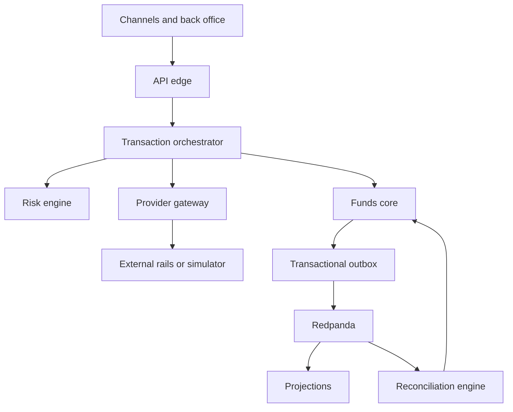

# Modern Core Banking System

## Comprehensive Architecture and Single-VPS Proof-of-Concept Design

**Status:** Revised design for technical review  
**Version:** 2.0  
**Date:** 2026-08-29  
**Base currency:** NGN (Naira)  
**Audience:** Architects, engineers, reviewers, security specialists, finance and reconciliation stakeholders

---

## 1. Purpose and decision summary

This document specifies a modern core banking architecture and a deliberately constrained proof of concept that can run on one VPS. It replaces the earlier architecture narrative with explicit ownership, consistency boundaries, state models, failure behaviour, security controls and acceptance tests.

The architecture is built around five decisions:

1. **The journal is the immutable financial record.** Operational transaction state is mutable and is stored separately.
2. **Funds control is one atomic boundary.** Ledger balances, available balances, holds, provider-float reservations and journals have one owner: `funds-core`.
3. **Provider ambiguity is preserved, never guessed away.** A timeout or unknown response produces an indeterminate attempt until reliable evidence resolves it.
4. **Database commits and event publication are connected by a transactional outbox.** The system assumes at-least-once delivery and makes every consumer idempotent.
5. **Reconciliation does not manufacture money.** Only externally evidenced value missing from the ledger is posted to suspense. Other mismatches create cases without duplicating financial entries.

The full single-VPS profile requires **4 vCPU, 16 GB RAM and NVMe-backed storage**. It demonstrates logical accounting invariants, concurrency safety, crash recovery, replay and modelled provider faults. It does not demonstrate high availability, independent failure domains, real rail behaviour, production throughput or regulatory certification.

---

## 2. Scope

### 2.1 In scope for the target architecture

- Append-only double-entry ledger
- Customer balances, holds and limits
- NGN and multi-currency accounts
- Inflows, intra-book and outbound transfers
- Card acquiring ledger shapes, including chargebacks
- Card issuing integration boundary, token-only core representation and asynchronous clearing
- VAS and FX workflow shapes
- Provider capability abstraction and routing
- Inline deterministic fraud and risk decisions
- Durable transaction orchestration
- Three-way settlement and reconciliation
- Customer statements, operational projections and point-in-time reporting
- Security, identity, privileged operations and auditability
- Production deployment and operational controls

### 2.2 In scope for the PoC

- Ledger and funds-control invariants
- Multi-currency posting and FX rounding
- Holds that reduce available balance without changing ledger balance
- Provider timeout, requery and indeterminate-state handling
- Multiple provider-gateway and funds-core replicas on one host
- Provider float reservation and exhaustion
- Transactional outbox, event replay and idempotent projections
- Three-way reconciliation with controlled suspense posting
- Signed journal-batch integrity proofs
- Backup, restore and projection rebuild exercises
- Fault injection through a deterministic provider simulator and network proxy

### 2.3 Explicitly outside the PoC

- Card issuing, PAN/PIN custody, HSM operation and PCI-DSS certification
- Real NIBSS, scheme, bank or aggregator connectivity
- Licensed sanctions and PEP datasets
- Asynchronous machine-learning fraud models and graph analysis
- Regulatory return formats
- Multi-node availability, multi-AZ failover and disaster recovery guarantees
- Production throughput and latency claims
- Ten-year retention-duration proof
- Production maker-checker integration with a corporate identity provider

The PoC still models roles, approvals and audit events so that privileged workflows have a credible production boundary.

---

## 3. Claims and non-claims

### 3.1 What the PoC may claim

If every acceptance test in §23 passes, the project may claim that:

- all committed journals balance per currency;
- customer and provider funds cannot be overspent under tested concurrency;
- holds and postings are distinct and convert exactly once;
- duplicate commands, webhooks and events do not duplicate financial effects;
- a crash between journal commit and event delivery does not lose the event;
- a provider timeout does not trigger an unsafe fallback;
- externally evidenced unmatched value is represented through suspense without double-counting;
- journal tampering is detectable against an externally stored signed root;
- derived balances and statements can be rebuilt from authoritative records.

### 3.2 What the PoC must not claim

The project must not describe itself as production-ready, highly available, PCI-compliant, CBN-certified or proven at a stated production throughput. Multiple containers on one host are independent processes but not independent failure domains.

---

## 4. Architectural principles

### 4.1 Financial facts and operational intent are separate

A `Transaction` records the business operation being attempted. A `ProviderAttempt` records one interaction with one external provider. A `Hold` reserves spendable funds. A `Journal` records a confirmed accounting fact. These objects have different lifecycles and must not be collapsed into one status column.

### 4.2 One owner for every invariant

No invariant may depend on coordinated writes to two service-owned schemas. Services may coordinate through commands and events, but the invariant owner must complete its mutation in one local database transaction.

### 4.3 At-least-once is the delivery model

HTTP retries, Temporal activity retries, Redpanda delivery and webhook delivery can all repeat. Exactly-once financial effect is achieved through unique command identities, inbox records and state-transition guards, not through an assumption of exactly-once transport.

### 4.4 Accounting corrections are additive

Postings and journals are never updated or deleted through application roles. Corrections use linked reversal or reclassification journals. Operational metadata may be appended, but it may not rewrite the financial fact.

### 4.5 Unknown means indeterminate

Unknown provider codes, malformed success responses, timeouts after submission, conflicting webhook and query results, and ambiguous `NOT_FOUND` responses map to `INDETERMINATE` unless the provider contract defines authoritative negative evidence.

### 4.6 Security is a system boundary

Authentication, authorisation, secrets, encryption, audit records, privileged approval and data minimisation are architectural requirements. They are not deferred deployment polish.

---

## 5. Non-negotiable invariants

| ID | Invariant | Enforcement owner | Enforcement mechanism |
|---|---|---|---|
| INV-01 | Every committed journal balances to zero independently for each currency | `funds-core` | Commit-time deferred database validation plus application validation |
| INV-02 | Every posting belongs to exactly one journal and one single-currency account | `funds-core` | Foreign keys and currency validation |
| INV-03 | Journals and postings cannot be updated or deleted by application roles | `funds-core` | Database privileges and immutable table rules |
| INV-04 | Available balance cannot fall below the authorised floor | `funds-core` | Account-row locks, active-hold calculation and atomic mutation |
| INV-05 | A hold is consumed, released or expired at most once | `funds-core` | Guarded state transition and unique command ID |
| INV-06 | One business command produces at most one financial effect | `funds-core` | Unique `command_id` and idempotent response storage |
| INV-07 | One provider attempt has one stable provider reference | `provider-gateway` | Unique attempt ID and deterministic reference derivation |
| INV-08 | Fallback cannot occur while a prior attempt may still settle | `txn-orchestrator` | Attempt-state guard and provider evidence policy |
| INV-09 | Every committed domain change that requires publication has a durable outbox record | Schema owner | State change and outbox insert in one database transaction |
| INV-10 | Every consumer applies one logical event at most once | Event consumer | Durable inbox keyed by event ID |
| INV-11 | An external-only cash item is posted to suspense at most once | `recon-engine` and `funds-core` | Source-record hash plus idempotent posting command |
| INV-12 | A ledger-only reconciliation break does not create a duplicate posting | `recon-engine` | Break-type policy |
| INV-13 | Materialised balances equal a replay of the journal | `funds-core` | Continuous sampling and scheduled full reconstruction |
| INV-14 | Journal content alteration is detectable outside the database trust boundary | Integrity anchor job | Canonical content hashes, signed Merkle roots and off-host root storage |
| INV-15 | Customer statements are derived from journal facts | `projections` | Replayable journal events and reconciliation against source |

Violation of INV-01 through INV-12 must fail the originating command. INV-13 through INV-15 are continuously verified and page an operator when violated.

---

## 6. System context



Only `api-edge` is exposed through the public reverse proxy. Postgres, Valkey, Redpanda, Temporal, MinIO and service management endpoints are private to internal container networks.

---

## 7. Service ownership and boundaries

The system has seven logical application services plus a provider simulator. They may begin as a monorepo and share build tooling, but they do not share database credentials or read each other's schemas.

| Service | Owns | Must not own |
|---|---|---|
| `api-edge` | Channel authentication, authorisation context, validation, edge idempotency, request-body hash, rate limits | Balances, holds, journals or provider state |
| `funds-core` | Accounts, journals, postings, materialised ledger balances, holds, available balances, provider-float reservations, account limits, outbox records for money events | Workflow sequencing or provider HTTP logic |
| `txn-orchestrator` | Transactions, product-specific workflow state, Temporal workflows, compensating business actions, retry schedules and manual-review tasks | Direct balance or hold mutation |
| `provider-gateway` | Capability registry, routing observations, provider attempts, adapters, normalisation, webhook inbox, shared breaker and provider rate limits | Authoritative balances or journals |
| `risk-engine` | Versioned rules, feature snapshots, decisions and explanations | Holds or ledger entries; it requests a typed hold through orchestration |
| `recon-engine` | Imported statements, provider reports, match decisions, breaks, cases, settlement cycles and proof results | Direct ledger-table access or direct posting inserts |
| `projections` | Operational read models, statements, reporting views and replay checkpoints | Authoritative financial state |
| `provider-simulator` | Deterministic external-rail behaviour and fault scripts | Any access to internal schemas or expected-result calculation |

All inter-service money mutations are commands to `funds-core`. Reconciliation, risk and orchestration never write the ledger schema directly.

---

## 8. Authoritative data model

### 8.1 Account

Each account has:

- immutable account ID;
- owner or control-account classification;
- account type and normal balance direction;
- exactly one currency;
- overdraft floor, normally zero;
- posting status: open, debit-blocked, credit-blocked or closed;
- accounting partition ID;
- created and closed timestamps.

Required account classes include customer liabilities, provider nostro/float assets, clearing, suspense, fee and commission income, provider expense, statutory liabilities, chargeback receivables, provisions, FX position, FX gain/loss and rounding residuals.

### 8.2 Journal and posting

A journal has an immutable UUID, database-generated journal sequence, command ID, correlation ID, business transaction ID, transaction type, narration, booking timestamp, value date, reversal reference and canonical content hash.

A posting contains account ID, currency, signed integer minor units, optional base-currency amount, rate reference, account sequence number and posting dimensions. The posting currency must equal the account currency.

Journal sequence orders committed facts for replay; it is not used as an externally meaningful timestamp. Gaps caused by rolled-back transactions are allowed.

### 8.3 Materialised balance

The materialised balance is updated in the same database transaction as its posting. It is an operational optimisation and can be reconstructed from postings. Each balance row carries a version and the most recent account sequence.

### 8.4 Hold

A hold is an encumbrance record, not a general-ledger posting. It has:

- hold ID and idempotent command ID;
- account, currency and amount;
- type: transaction, risk, card authorisation or provider float;
- status: `ACTIVE`, `CONSUMED`, `RELEASED` or `EXPIRED`;
- transaction and provider-attempt references where applicable;
- expiry time and reason;
- creation and terminal timestamps.

Available balance is derived from the materialised ledger balance, active debit holds, credit policy and account normal direction. The formula is implemented once inside `funds-core` and exposed through an API; consumers do not reproduce it.

### 8.5 Transaction and provider attempt

A transaction is the customer-visible business operation. A provider attempt is one submission to one provider. A transaction can have several attempts over time, but only one attempt may be settlement-capable at any instant unless the product explicitly allows split execution.

### 8.6 Outbox and inbox

Every authoritative schema has an outbox with event ID, aggregate ID, aggregate version, event type, schema version, payload, creation time, publish status and attempt count. Each consumer has an inbox with consumer name, event ID, received time and processing result.

Payloads exclude unnecessary PII. Account IDs and transaction IDs are preferred to customer names, BVN, NIN, PAN or complete account numbers.

### 8.7 Reconciliation evidence

Imported files and API reports retain source identity, retrieval time, statement period, cryptographic file hash and raw-object location. Normalised lines retain the source line identity and original text reference. A source line can produce at most one suspense command.

### 8.8 Bitemporal fields

Financial facts preserve:

- **booking time:** when the system recorded the fact;
- **value date:** when the financial effect is effective;
- **source event time:** when an external party says it occurred;
- **ingestion time:** when the external fact entered this system.

Corrections append new facts with links to superseded interpretations. They do not overwrite earlier knowledge. Point-in-time reports select facts by both booking/ingestion knowledge and value-date effectiveness.

---

## 9. Ledger and funds-control transaction protocol

### 9.1 Posting command

Every posting command follows this sequence inside one PostgreSQL `SERIALIZABLE` transaction:

1. Insert or read the idempotency record keyed by `command_id`. If a completed record exists, return its stored result. If the same ID has a different canonical request hash, reject it.
2. Validate that every account exists, is open for the requested direction and has the required currency.
3. Sort all affected account IDs canonically and lock their balance rows in that order using `SELECT ... FOR UPDATE`.
4. Lock any hold or provider-float reservation being consumed or released.
5. Re-evaluate available balance and account limits under the locks.
6. Validate that the proposed postings sum to zero for every currency.
7. Insert the immutable journal and postings. Assign account sequence numbers while the account rows are locked.
8. Update materialised balances and transition associated holds exactly once.
9. Insert the corresponding outbox event in the same transaction.
10. Store the command result and commit.

PostgreSQL serialization failures and deadlocks are retried with bounded decorrelated jitter. A command is attempted no more than five times before returning a retryable internal error. Retrying uses the same `command_id`.

### 9.2 Commit-time balance enforcement

Application validation is backed by a deferred database constraint trigger that refuses to commit a journal whose postings fail per-currency zero-sum validation. Database roles used by the services cannot disable the trigger or update/delete journals and postings.

### 9.3 Hold lifecycle

- **Create:** lock account, recompute available balance, create `ACTIVE` hold and outbox event.
- **Consume:** lock active hold and posting accounts, create confirmed journal, move hold to `CONSUMED` in the same transaction.
- **Release:** lock active hold and mark `RELEASED`; no journal is created because no ledger balance changed.
- **Expire:** use the same transition as release, initiated by a durable scheduled workflow.

An expired, consumed or released hold cannot transition again. Late provider success after release is treated as an operational exception and reconciled; the system does not silently recreate the hold.

### 9.4 Provider-float reservation

Routing reads a non-authoritative snapshot of available provider float. Before submission, orchestration requests an atomic float hold from `funds-core`. If the reservation fails, the router selects another eligible provider before any external submission. Confirmation consumes the customer hold and provider-float hold into the final journal; authoritative failure releases both.

### 9.5 Hot control accounts

The default PoC begins with one nostro account per provider and currency and demonstrates contention directly. Sharding is introduced only after measurements show the need.

When sharding is enabled:

- internal subaccounts map to one real external settlement account;
- shard selection is deterministic from transaction ID;
- each shard has an explicit liquidity allocation or an aggregate reservation policy;
- reconciliation aggregates the shards before comparing to the bank statement;
- all shard-to-shard rebalancing uses balanced journals;
- reports expose both shard and aggregate balances.

Sharding is not described as a DynamoDB-specific solution; it is a general response to a contended accounting control account.

### 9.6 Tamper evidence without a global write lock

Every journal receives a canonical content hash. A background job periodically builds a Merkle tree over a closed batch of journal hashes and signs the root. The manifest contains journal sequence IDs, hashes, batch boundaries, algorithm version and signing-key ID.

Signed roots and manifests are copied to encrypted off-host object storage with retention controls. Verification recomputes leaf hashes and the root and compares them with the externally stored signature. This avoids a globally locked previous-hash pointer while putting the integrity proof outside the database administrator's trust boundary.

---

## 10. Multi-currency and FX

### 10.1 Representation

- Monetary amounts are signed integers in currency minor units.
- Currency scale is versioned reference data.
- Exchange rates are fixed-precision decimals or rational numerator/denominator pairs, never binary floating point.
- Each quote declares rate direction, precision, rounding mode, expiry, spread and source.

### 10.2 FX accounting

An FX trade creates two separately balanced currency journals linked by one trade ID:

- the sold-currency journal moves value through that currency's FX position account;
- the bought-currency journal moves value through the corresponding position account;
- NGN base equivalents and the booked quote are retained for reporting;
- rounding differences post to an explicit rounding account;
- fee and spread components are stated explicitly rather than inferred.

Reversal uses the original booked rate for accounting reversal. Any economic difference caused by a later offsetting market trade is a new realised gain/loss fact, not a rewrite of the original trade.

### 10.3 Example inflow

For a final ₦1,000.00 inflow with a ₦10.00 customer fee:

| Account | Debit | Credit |
|---|---:|---:|
| Provider NGN float | ₦1,000.00 | — |
| Customer NGN liability | — | ₦990.00 |
| Fee income | — | ₦10.00 |

The journal balances. If the fee is charged separately, the credit journal and fee journal are separate balanced facts.

---

## 11. Transaction and attempt state models

### 11.1 Common transaction envelope

The common envelope provides reporting consistency without forcing every product into an identical internal state machine.

| State | Meaning |
|---|---|
| `INITIATED` | Valid request accepted and idempotency identity established |
| `SCREENED` | Risk decision recorded |
| `AUTHORISED` | Required customer and provider-float holds are active |
| `PROCESSING` | Product-specific workflow is running |
| `ACTION_REQUIRED` | Human, customer or external documentation is required |
| `INDETERMINATE` | At least one attempt may still produce an external financial effect |
| `CONFIRMED` | Product confirmation condition is met and required posting completed |
| `FAILED` | No external financial effect can occur and holds are released |
| `SETTLED` | Reconciliation confirms settlement obligation completion |
| `REVERSED` | A linked accounting reversal has completed |

Product workflows define which states apply. For example, an intra-book transfer moves from `AUTHORISED` to `CONFIRMED` without a provider attempt; card acquiring can be confirmed before later settlement.

### 11.2 Provider-attempt states

| State | Meaning |
|---|---|
| `CREATED` | Provider selected and stable internal attempt ID assigned |
| `RESERVED` | Provider float reservation succeeded |
| `SUBMITTING` | Submission has begun; a network failure from this point may be ambiguous |
| `ACKNOWLEDGED` | Provider accepted the request but final outcome is pending |
| `INDETERMINATE` | Outcome cannot be proved from current evidence |
| `REJECTED_FINAL` | Provider contract supplies authoritative non-acceptance evidence |
| `CONFIRMED` | Provider confirms the financial action |
| `SETTLED` | Settlement evidence is matched |
| `REVERSED` | Provider and internal reversal requirements are satisfied |

### 11.3 Fallback gate

A fallback attempt is legal only when all earlier attempts are in `REJECTED_FINAL`, or when the provider contract guarantees that reuse of the same end-to-end operation identity cannot create a second settlement across the attempted route.

The following are not sufficient proof on their own:

- HTTP timeout;
- connection reset after request write;
- empty response;
- unknown response code;
- transient query error;
- `NOT_FOUND` without a provider guarantee defining it as authoritative non-acceptance.

If proof is unavailable, the transaction remains `INDETERMINATE`, the requery workflow continues, and an SLA-driven case is opened. Manual review cannot simply override the guard; it must record external evidence or invoke an explicitly approved loss-control procedure.

### 11.4 Compensation policy

Sagas use forward recovery. A financial action is never described as rolled back after an external party may have observed it. Compensations are explicit business operations such as releasing an unconsumed hold, submitting a reversal, or posting a correction journal.

---

## 12. Provider capability and routing architecture

### 12.1 Capability ports

| Port | Core operations |
|---|---|
| Collections | Issue virtual account, resolve inbound credit, query credit finality |
| Payouts | Name enquiry, submit transfer, query status, request reversal |
| Card acquiring | Authorise, capture, refund, receive dispute |
| Card issuing | Provision tokenised card reference, consume authorisation stream, apply controls, ingest clearing and settlement files |
| VAS | Validate customer, purchase, requery |
| FX | Quote, execute, query, issue settlement instruction |

Card issuing remains outside the PoC. In the target architecture, PAN and PIN are confined to a PCI-DSS-segmented tokenisation and HSM boundary; the core receives tokens and permitted metadata only.

### 12.2 Provider contract metadata

The capability registry is versioned data and declares:

- supported operations, currencies, corridors, banks and amount bands;
- provider-reference constraints and idempotency behaviour;
- status-query semantics, including whether `NOT_FOUND` is authoritative;
- finality level and expected settlement schedule;
- timeout and retry policy per operation;
- webhook signature and replay-window requirements;
- cost, SLA, rate limit and prefunded account;
- enabled state and maker-checker approval metadata.

Configuration changes are audited and require approval in production.

### 12.3 Routing sequence

1. Filter providers by capability, destination, amount, currency and operational enablement.
2. Score eligible providers using cost, segmented success rate, circuit state and non-authoritative float snapshot.
3. Select the highest-ranked candidate.
4. Request an atomic provider-float reservation from `funds-core`.
5. Create a provider attempt and deterministic provider reference.
6. Submit once under the provider's idempotency contract.
7. Resolve the attempt through synchronous response, verified webhook, status query or reconciliation evidence.

If float reservation fails, routing may choose another provider because no submission occurred. After submission begins, the fallback gate in §11.3 applies.

### 12.4 Response normalisation

Canonical outcomes include `ACCEPTED`, `CONFIRMED`, `REJECTED_FINAL`, `DUPLICATE`, `LIMIT_EXCEEDED`, `INVALID_BENEFICIARY`, `PROVIDER_UNAVAILABLE` and `INDETERMINATE`.

Unknown, contradictory or structurally invalid responses map to `INDETERMINATE`. Provider payload and normalisation-rule version are retained for audit with sensitive fields redacted or encrypted.

### 12.5 Webhooks

Webhook processing performs, in order:

1. size and content-type limits;
2. signature verification against a rotated key set;
3. timestamp/replay-window validation;
4. durable receipt and deduplication by provider event identity and body hash;
5. mapping to the provider attempt;
6. legal state-transition validation;
7. canonical event publication through an outbox.

Out-of-order events are retained. They advance state only if the transition is legal and do not regress a confirmed or settled attempt.

### 12.6 Shared resilience state

Circuit-breaker and rate-limit state is stored in Valkey and namespaced by provider and operation. Every operation has an explicit cache-loss policy:

- transfers fail closed for rate-limit uncertainty but allow status queries;
- webhook ingestion remains available with local backpressure;
- circuit state loss enters a conservative half-open mode;
- risk velocity uncertainty produces a configurable step-up or hold, never an undocumented fail-open.

The PoC runs at least two provider-gateway replicas so an in-process implementation fails its tests.

---

## 13. Product workflows

### 13.1 Intra-book transfer

1. Validate and screen.
2. Atomically create a customer hold.
3. In one funds-core transaction, consume the hold and post debit customer A / credit customer B.
4. Publish the committed journal event through the outbox.
5. Mark transaction confirmed.

No external provider or clearing account participates.

### 13.2 Outbound transfer

1. Perform name enquiry using a short-lived cache keyed by provider, bank and account.
2. Screen the request.
3. Create customer hold.
4. Route and reserve provider float.
5. Submit one provider attempt.
6. On confirmation, atomically consume both holds and post customer liability reduction against provider float/clearing according to settlement model.
7. On authoritative failure, release both holds.
8. On ambiguity, retain holds subject to policy, requery and open a case before the maximum hold SLA.
9. On settlement, move clearing to settled accounts where required.

### 13.3 Inbound collection

1. Verify and deduplicate provider evidence.
2. Determine whether the provider evidence is final or uncleared.
3. If final, post provider float debit and customer liability/fee credits.
4. If not final, credit an uncleared customer sub-balance and release it only after confirmation.
5. Reconcile provider report and bank statement.

### 13.4 Card acquiring

Authorisation, capture, clearing, settlement, refund and chargeback are distinct events. Chargeback receivable, provision and recovery accounts exist from the first implementation. Card issuing and PAN/PIN custody are excluded.

### 13.5 VAS

Validation precedes purchase. After an irreversible fulfilment may have occurred, timeout remains indeterminate. Gross purchase, provider cost and commission are accounted separately.

### 13.6 FX

Quotes expire deterministically. Execution refers to the exact quote and rate representation. Both currency journals commit through one funds-core database transaction so one side cannot exist without the other.

### 13.7 Card issuing target boundary

The target architecture consumes a real-time tokenised authorisation stream and returns approve or decline within the scheme deadline. Authorisation creates or adjusts a card hold; clearing consumes the hold and posts the journal asynchronously. PAN, PIN blocks and cryptographic keys never enter core-service payloads, logs, events or databases. This boundary is specified for production evolution but is not simulated by the PoC.

---

## 14. Risk and fraud

### 14.1 PoC inline tier

The PoC implements deterministic, versioned rules using cached features:

- transaction and amount velocity;
- first-time beneficiary;
- device or session change;
- IP/geo inconsistency;
- amount deviation from account history;
- known beneficiary and account risk markers.

Outcomes are `ALLOW`, `STEP_UP`, `HOLD` and `BLOCK`. The decision records rule-set version, input-feature snapshot references, reason codes and execution time.

Risk never writes a hold. It returns a decision; orchestration requests the corresponding typed hold from `funds-core`.

### 14.2 Governance

- Rule changes are versioned and audited.
- New or materially changed rules run in shadow mode before enforcement.
- Production enablement requires maker-checker approval.
- False-positive and abandonment metrics are segmented by rule and customer cohort.
- Sensitive feature values are not emitted into logs or metric labels.

Asynchronous ML scoring, sanctions screening and graph analysis are target-architecture extensions, not PoC deliverables.

---

## 15. Settlement and reconciliation

### 15.1 Three evidence sets

Reconciliation compares:

1. internal journals and provider attempts;
2. the provider's transaction or settlement report;
3. the bank statement for the actual settlement account.

No one source is treated as truth for all break classes.

### 15.2 Matching

Matching proceeds from strongest to weakest evidence:

1. exact end-to-end reference and amount;
2. exact provider reference and amount;
3. deterministic composite key defined for the provider;
4. fuzzy amount/date/counterparty candidate.

Fuzzy matches are suggestions. They require human approval unless a separately approved rule has demonstrated an acceptably low false-match rate.

### 15.3 Break taxonomy and accounting action

| Break type | Meaning | Accounting action |
|---|---|---|
| External cash item missing internally | Bank statement proves cash movement with no internal journal | Post nostro against suspense exactly once; open case |
| Provider report item missing internally | Provider evidence exists but cash evidence may not | Open case; post only when accounting policy defines the evidence as sufficient |
| Internal journal missing at provider | Internal financial fact exists but provider omits it | Open case; do not duplicate the journal |
| Internal/provider item missing at bank | Expected timing or settlement difference | Classify in-transit; no duplicate posting |
| Amount mismatch | References match but values differ | Open case; post only the externally evidenced difference under approved policy |
| Duplicate external item | Repeated source fact | Dedupe and case; no new posting |
| Reversal or chargeback | New external financial fact | Create linked reversal/reclassification journal |

### 15.4 Suspense lifecycle

Every suspense command includes provider, account, currency, source document hash, source line ID and break ID. Their composite identity is unique.

When the item is explained, reconciliation sends a new idempotent command that reclassifies or reverses suspense into the correct account. It does not edit the suspense journal. Suspense age, amount and owner are monitored with an SLA.

### 15.5 Daily proof

For each external settlement account and currency, the engine proves:

```text
external bank closing balance
= internal nostro closing balance
 + approved signed timing differences
```

Sign conventions are defined per account normal direction in implementation tests. After external-only movements are booked to suspense, unexplained residual must be zero. Provider-report mismatches remain visible as cases even when the cash proof closes.

Proof results include input hashes, cutoff times, exchange/holiday calendar, included timing items, residual, run ID and approval status.

---

## 16. Eventing, projections and reporting

### 16.1 Transactional outbox relay

An outbox relay reads committed unpublished records, publishes them to Redpanda and marks publication progress. A crash may cause repeat publication, never silent loss. Consumers insert the event ID into their inbox in the same local transaction as their projection update.

### 16.2 Topic and ordering model

- Events are ordered per aggregate or account key, not globally.
- Ledger journal events are keyed by accounting partition.
- Provider-attempt events are keyed by transaction ID.
- Schema versions are explicit and backward-compatible within a supported window.
- Retry topics and a dead-letter topic replace SQS-style visibility and DLQ behaviour.
- Long delays and business timers are handled by Temporal rather than a message broker.

Redpanda replaces Kafka's replay and consumer-group role only. EventBridge routing and SQS FIFO semantics are reproduced explicitly through topic design, inbox deduplication, retry topics and workflow timers.

### 16.3 Projection rebuild

Every projection declares:

- source topic and schema versions;
- inbox/checkpoint state;
- deterministic rebuild procedure;
- reconciliation check against authoritative journal totals;
- point-in-time cutoff semantics.

Customer statements contain journal-derived entries. Operational transaction status may be joined for display but cannot replace or alter accounting facts.

### 16.4 Analytics and archive

The PoC may export journal events and reconciliation evidence to MinIO as Parquet to demonstrate archival shape. Full Iceberg lifecycle and warehouse transformations are deferred. Production archives use encrypted off-host object storage with retention controls and signed integrity manifests.

---

## 17. Security and compliance architecture

### 17.1 Identity and authorisation

- Channels authenticate through an OIDC-compatible identity provider.
- API edge propagates signed, minimal identity and authorisation context.
- Services use distinct identities and database roles.
- Production service-to-service traffic uses mTLS or an equivalent authenticated private transport.
- Authorisation is deny-by-default and based on roles plus resource context.
- Privileged actions—manual posting, account unblocking, routing-rule changes, suspense resolution and reversal approval—require maker-checker separation.

### 17.2 Network boundaries

Only the reverse proxy and API edge accept public traffic. Databases, brokers, caches, object storage, Temporal and administrative endpoints run on private networks. Provider webhooks terminate at a dedicated authenticated route with strict request limits.

### 17.3 Secrets and keys

“No secrets manager” is not an allowed mode. The PoC uses one of:

- SOPS-encrypted configuration plus Docker secrets; or
- Vault with a documented unseal and backup procedure.

Secrets are never committed in plaintext, baked into images or printed in logs. Production uses managed KMS/HSM controls where required, with rotation, least privilege and break-glass audit.

### 17.4 Data protection

The governing privacy baseline is the Nigeria Data Protection Act 2023 and applicable implementation directives, supplemented by product-specific CBN and payment-scheme requirements.

- Collect and retain only required PII.
- Encrypt sensitive fields at rest with separable keys.
- Mask account identifiers in logs and interfaces.
- Do not place BVN, NIN, PAN, customer names or full account numbers in metric labels, traces, event headers or Temporal search attributes.
- Define data-subject, legal-hold and deletion handling without deleting immutable financial records that must legally be retained.
- Document data location, processors and cross-border transfers before production deployment.

### 17.5 Audit

Security and privileged-operation audit records are append-only, access-controlled and exported off-host. They record actor, action, target, before/after configuration hash, approval, time, correlation ID and outcome. Audit events are distinct from financial journals but linked where relevant.

### 17.6 Retention

Retention is a policy matrix by record class and governing instrument. The design does not claim a universal ten-year period. Journal, statement, customer-identification, cheque, dispute, security-log and consent records can have different minimum and maximum retention obligations.

---

## 18. Observability and operational controls

### 18.1 Telemetry

OpenTelemetry provides traces and metrics through the OTel Collector. Logs use structured JSON and correlation IDs. Telemetry redaction is tested.

### 18.2 Required business metrics

- transaction outcome by product;
- provider success rate segmented by provider, operation and destination bank;
- indeterminate age and count;
- active hold age and amount;
- provider float available and reserved;
- reconciliation residual and break age;
- suspense balance and ageing;
- outbox publication lag;
- consumer inbox/replay lag;
- serialization retry and deadlock rate;
- journal-to-materialised-balance mismatch count.

Labels use controlled identifiers to avoid high-cardinality customer data.

### 18.3 Health endpoints

- `/health` reports whether the process can execute.
- `/ready` reports whether it can safely receive its class of work.

Readiness does not claim that all dependencies will stay available. Services implement bounded connection retries, backpressure and graceful degradation after startup. Compose startup ordering is convenience, not a correctness dependency.

### 18.4 Operational runbooks

The project includes runbooks for:

- growing indeterminate backlog;
- outbox relay failure;
- provider breaker activation;
- float exhaustion;
- reconciliation residual;
- active-hold expiry failure;
- balance invariant alert;
- restore and projection rebuild;
- signing-key rotation;
- secret exposure.

---

## 19. Failure behaviour

| Failure | Required behaviour |
|---|---|
| API client retries | Same edge key and body returns same transaction; different body is rejected |
| Funds-core crashes before commit | No journal, balance, hold transition or outbox record becomes visible |
| Funds-core crashes after commit | Idempotent retry returns committed result; outbox relay eventually publishes |
| Event published twice | Consumer inbox prevents duplicate projection effect |
| Consumer crashes mid-update | Projection update and inbox insert commit together or both roll back |
| Provider timeout after request write | Attempt becomes indeterminate; no unsafe fallback |
| Conflicting provider evidence | Preserve evidence, remain indeterminate and open case |
| Duplicate/out-of-order webhook | Store once and apply only legal monotonic transition |
| Valkey unavailable | Apply documented conservative policy per capability |
| Temporal activity repeats | Activity command uses stable idempotency key |
| Temporal workflow code changes | Versioned workflow replays deterministically |
| Redpanda unavailable | Outbox accumulates under a bounded quota; financial commits continue until the safety threshold |
| Postgres unavailable | Money mutations fail closed; read models may remain available and visibly stale |
| MinIO unavailable | Core posting continues; imports and archive jobs pause safely |
| External-only bank item | Idempotent suspense journal and case |
| Ledger-only break | Case without a second posting |
| Host loss | Service is unavailable; recovery uses off-host backup. No HA claim is made |

---

## 20. Production deployment target

### 20.1 Production substrate

| Concern | Target choice |
|---|---|
| Ledger and service databases | Aurora PostgreSQL or managed PostgreSQL, isolated by database/role and backed by PITR |
| Durable workflows | Temporal Cloud where regulatory and residency requirements permit, otherwise a secured self-hosted Temporal service |
| Event stream | MSK/Kafka with schema governance and multi-AZ replication |
| Cache and shared resilience | ElastiCache/managed Valkey with explicit cache-loss behaviour |
| Object archive | S3 with encryption, versioning, object lock where policy requires, and lifecycle rules |
| Compute | ECS or EKS with always-warm funds and authorisation paths |
| Secrets and crypto | Secrets Manager/KMS and HSM-backed controls for regulated cryptographic custody |
| Observability | OTel-based managed metrics, logs and traces with redaction |
| Delivery | Infrastructure as code, separated environments, signed images, controlled migrations and progressive deployment |

### 20.2 Availability and recovery

Production defines service-specific SLOs, RTO and RPO. Multi-AZ database, broker and cache deployment does not remove the need for restore tests. The journal, outbox and signed integrity manifests form the authoritative recovery chain; projections are rebuildable.

### 20.3 Database migration controls

Migrations are backward-compatible across a rolling-deployment window:

1. expand schema;
2. deploy readers/writers compatible with old and new forms;
3. backfill with reconciliation;
4. switch behaviour;
5. remove obsolete fields in a later release.

Ledger-table destructive migrations require exceptional approval and verified backup.

---

## 21. Single-VPS PoC deployment

### 21.1 Supported profile

The full profile is supported on **4 vCPU, 16 GB RAM and NVMe storage**. An 8 GB host is a reduced developer profile and cannot be used for the full demonstration claim.

Indicative full-profile budgets are limits to validate, not guaranteed consumption:

| Component | Budget |
|---|---:|
| PostgreSQL, including Temporal databases | 2.5 GB |
| Redpanda single broker | 2.5 GB |
| Temporal services and UI | 1.5–2.0 GB |
| Valkey | 0.5 GB |
| Prometheus, Grafana, Tempo and OTel Collector | 2.0 GB |
| MinIO | 0.75 GB |
| Application replicas and simulator | 3.0 GB |
| Reverse proxy, fault proxy, OS and headroom | 2.75–3.25 GB |

Actual limits are established by a committed soak-test report. Memory pressure that causes swapping invalidates latency observations.

### 21.2 Compose topology

Docker Compose is the PoC orchestrator. It runs:

- Caddy or Traefik;
- two `api-edge` replicas if external load balancing is demonstrated;
- two or three `funds-core` replicas;
- two or three `provider-gateway` replicas;
- one or more Temporal workers for orchestration;
- risk, reconciliation and projection services;
- provider simulator and Toxiproxy;
- PostgreSQL, Redpanda, Valkey, Temporal, MinIO and observability services.

Scaled services do not set `container_name` and do not bind duplicate fixed host ports. The reverse proxy discovers them on the internal network.

### 21.3 Startup and migration

Health-conditioned dependencies improve startup ergonomics but are not correctness controls. One-shot migration services complete before application readiness. Applications retry dependency connections and become unready when they cannot safely process work.

### 21.4 Storage

Named volumes hold local PoC state. Encrypted off-host object storage receives:

- PostgreSQL base backup and WAL archive or an equivalently tested PITR stream;
- signed journal integrity roots and manifests;
- exported reconciliation evidence required for restore exercises.

MinIO on the same host is a functional object-store substitute, not a backup failure domain.

### 21.5 Secrets

Developer-local secrets are mounted through Docker secrets from files excluded from version control. The committed repository contains templates and secret-generation instructions, never working credentials.

### 21.6 Temporal deployment

Temporal persistence and visibility use separate PostgreSQL databases and roles from application schemas. Temporal endpoints are internal-only. Workflow payloads contain identifiers rather than raw PII. Workflow versioning and activity idempotency are part of CI.

### 21.7 Redpanda semantics

The PoC uses one broker and therefore makes no broker-availability or replicated-durability claim. Topics have explicit retention, partition keys, retry policy and dead-letter handling. Event loss from total host/disk loss is addressed only through restore procedures, not clustering.

### 21.8 Twelve-factor portability

Application services:

- use external configuration but consume secrets through mounted secret files or a secrets API;
- write no durable local application state;
- expose separate liveness and readiness endpoints;
- drain requests and workers on `SIGTERM`;
- log to stdout;
- run one application process per container;
- use immutable images and explicit schema migrations.

These disciplines make Kubernetes migration credible, but production Kubernetes still requires separate designs for persistent storage, network policy, ingress, secrets, disruption budgets, autoscaling and operational ownership.

---

## 22. Provider simulator and fault injection

The simulator is an external black box from the application's perspective. It has no database access and does not calculate test success. Test fixtures define simulator behaviour; independent assertions inspect APIs, journals and evidence.

Every scenario is deterministic by seed and supports replay:

- timeout followed by success;
- timeout followed by authoritative failure;
- ambiguous and authoritative `NOT_FOUND` variants;
- unknown and malformed response codes;
- duplicate, delayed and out-of-order webhooks;
- old-event replay after outage;
- conflicting query and webhook evidence;
- partial settlement;
- reversal after fee booking;
- provider float exhaustion;
- destination-bank-specific degradation;
- rate limiting;
- signature failure and replay-window violation;
- connection loss before and after request-body transmission.

Toxiproxy or an equivalent network fault proxy adds latency, disconnection and half-open connection behaviour between application containers and the simulator, Valkey, Redpanda and selected non-authoritative dependencies. These faults simulate network conditions but do not prove multi-host partition tolerance.

---

## 23. Verification and acceptance plan

### 23.1 Required acceptance matrix

| ID | Scenario | Oracle and pass condition |
|---|---|---|
| ACC-01 | Submit an unbalanced or mixed-currency journal | Commit is rejected; no balance or outbox mutation exists |
| ACC-02 | Run 100 concurrent debits against limited funds through multiple funds-core replicas | Successful debits never exceed available funds; materialised and replayed balances agree |
| ACC-03 | Race hold consume, release and expiry commands | Exactly one terminal hold transition succeeds |
| ACC-04 | Crash after journal commit but before outbox acknowledgement | One logical event is eventually applied once by every projection |
| ACC-05 | Publish the same event repeatedly and restart consumers mid-update | Inbox prevents duplicate effects; rebuilt projection matches source |
| ACC-06 | Provider timeout followed by success | No fallback occurs; one external payout and one confirmed journal exist |
| ACC-07 | Provider timeout followed by authoritative rejection | Holds release exactly once; fallback may proceed under policy |
| ACC-08 | Provider returns non-authoritative `NOT_FOUND` | Transaction stays indeterminate and no fallback occurs |
| ACC-09 | Deliver duplicate and out-of-order webhooks | One legal monotonic attempt state and one financial effect result |
| ACC-10 | Exhaust provider float under concurrent routing | Atomic float reservations prevent oversubscription; eligible alternate route is selected only before submission |
| ACC-11 | Provide external bank item absent from internal ledger | One suspense posting and one case are created despite repeated imports |
| ACC-12 | Provide internal item absent from provider report | Case is created without an additional financial posting |
| ACC-13 | Resolve a suspense item | New linked reclassification/reversal journal is created; original remains immutable |
| ACC-14 | Tamper with archived journal content | Verification fails against the off-host signed root |
| ACC-15 | Destroy projections and replay to a cutoff | Statements and balances reproduce exactly at the cutoff |
| ACC-16 | Restart database, broker, cache and workflow workers at controlled points | Documented failure policy occurs; no duplicate journal is produced |
| ACC-17 | Change workflow code with in-flight workflows | Historical and new workflow versions replay without nondeterminism |
| ACC-18 | Restore from off-host backup and rebuild derived state | Trial balance, journal hashes, holds and projection checks match the recorded recovery checkpoint |

### 23.2 Property-based tests

Generated command sequences verify:

- per-currency journal balance;
- no spend beyond authorised floor;
- reversal restores the appropriate accounting position exactly;
- hold terminal-state uniqueness;
- idempotent command equivalence;
- multi-currency rounding residual treatment;
- account sequence monotonicity;
- journal immutability;
- projection replay equivalence.

### 23.3 Contract and integration tests

Every provider adapter passes the same conformance suite for reference stability, retry rules, response normalisation, webhook verification, query semantics and finality metadata. The suite includes provider-specific expected exceptions rather than forcing unsupported capabilities into one broad interface.

### 23.4 CI gates

The main branch requires:

- unit and property-based tests;
- database constraint and migration tests;
- adapter conformance tests;
- workflow replay tests;
- event outbox/inbox crash tests;
- dependency and container vulnerability scanning;
- secret scanning;
- telemetry PII/redaction tests;
- deterministic build and signed image metadata;
- the named critical scenarios ACC-01 through ACC-13.

Longer restore, tamper, soak and full-fault scenarios run on a scheduled pipeline and before a tagged demonstration release.

### 23.5 Exit criteria

The PoC is complete only when:

1. every acceptance scenario has reproducible commands, a seed where applicable and retained results;
2. all P0 invariants pass with no unexplained exception;
3. a restore drill succeeds from off-host backup;
4. an independent journal replay agrees with materialised balances;
5. the README reproduces the claims and non-claims in §3;
6. resource consumption on the supported host remains within declared limits during the soak test;
7. known limitations and any waived non-critical failures are recorded explicitly.

---

## 24. Delivery sequence

This design should be implemented in vertical correctness slices rather than by creating every service shell first.

1. **Funds core:** accounts, balanced journals, balances, idempotent commands and property tests.
2. **Holds and concurrency:** available balance, hold lifecycle, canonical locks and multi-replica race tests.
3. **Outbox and projections:** durable publication, inbox deduplication, statement replay.
4. **Outbound transfer:** transaction/attempt split, simulator, timeout/requery and fallback guard.
5. **Provider routing:** capability registry, float reservations, shared breaker and segmented metrics.
6. **Reconciliation:** imported evidence, break taxonomy, suspense lifecycle and daily proof.
7. **Multi-currency and FX:** rate precision, rounding and linked journals.
8. **Security and operations:** identity integration, privileged audit, off-host backup, restore and signed integrity roots.
9. **Demonstration hardening:** full acceptance matrix, soak tests, runbooks and limitation statement.

Each slice must pass its invariant tests before the next slice adds product breadth.

---

## 25. Review checklist

A reviewer should reject the design or implementation if any answer below is unclear:

- Can one database transaction enforce each money invariant?
- Is the owner of balances, holds, float reservations and journals unambiguous?
- Can a committed journal ever lack a durable outbox record?
- Can any retry create a second financial effect?
- What exact evidence permits provider fallback?
- Does each reconciliation break type have a correct accounting action?
- Can a ledger-only break avoid a duplicate posting?
- Is tamper evidence anchored outside the database trust boundary?
- Can projections and statements be rebuilt deterministically?
- Are public, service, data and privileged-operation trust boundaries explicit?
- Are secrets required and PII excluded from telemetry and workflow search metadata?
- Are the PoC's claims narrower than the evidence it produces?

---

## 26. Final architecture statement

The architecture treats money movement as a set of durable, independently evidenced facts rather than a synchronous API call. `funds-core` provides the atomic financial boundary; orchestration manages intent; provider attempts preserve external uncertainty; the outbox and inbox connect committed facts to replayable events; reconciliation explains differences without inventing entries; and externally anchored integrity proofs make silent historical alteration detectable.

The single-VPS deployment is valuable because it can make these behaviours executable under concurrent and fault-injected conditions. Its credibility depends on disciplined claims: it proves logical invariants and recovery behaviour within one-host constraints, not high availability or regulatory readiness.
