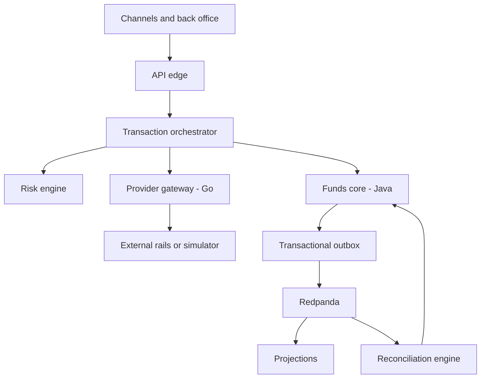

# Modern Core Banking System

## Comprehensive Architecture and Single-VPS Proof-of-Concept Design

**Status:** Architecture-review revision for PoC approval
**Version:** 3.1
**Date:** 2026-08-30
**Base currency:** NGN (Naira)
**Audience:** Architects, engineers, reviewers, security specialists, finance and reconciliation stakeholders

---

## 1. Purpose and decision summary

This document specifies a modern core banking architecture and a deliberately constrained proof of concept that can run on one VPS. It replaces the earlier architecture narrative with explicit ownership, consistency boundaries, state models, failure behaviour, security controls and acceptance tests.

The architecture is built around five decisions:

1. **The journal is the immutable financial record.** Operational transaction state is mutable and is stored separately.
2. **Funds control is one atomic boundary.** Ledger balances, available balances, holds, provider-float reservations and journals have one owner: `funds-core`.
3. **Provider ambiguity is preserved, never guessed away.** A timeout or unknown response produces an indeterminate attempt until reliable evidence resolves it.
4. **Database commits and event publication are connected by a transactional outbox.** The system assumes at-least-once delivery and makes every consumer idempotent.
5. **Reconciliation does not manufacture money.** Only externally evidenced value missing from the ledger is posted to suspense. Other mismatches create cases without duplicating financial entries.

The supported single-VPS profile targets **4 vCPU, 8 GiB RAM, NVMe-backed storage and zero swap during evidence-producing tests**. `funds-core` is implemented in Java; every other application service is implemented in Go. Because every replica and diagnostic tool cannot safely run at peak load at once on 8 GiB, the PoC uses declared normal, concurrency/fault and restore/replay profiles. It demonstrates logical accounting invariants, concurrency safety, process-crash recovery, replay and modelled provider faults. It does not demonstrate high availability, independent failure domains, broker durability under host loss, real rail behaviour, production throughput or regulatory certification.

---

## 2. Scope

### 2.1 In scope for the target architecture

- Append-only double-entry ledger
- Customer balances, holds and limits
- NGN and multi-currency accounts
- Inflows, intra-book and outbound transfers
- Card acquiring ledger shapes, including chargebacks
- Card issuing integration boundary, token-only core representation and asynchronous clearing
- VAS and FX workflow shapes
- Provider capability abstraction and routing
- Inline deterministic fraud and risk decisions
- Durable transaction orchestration
- Three-way settlement and reconciliation
- Customer statements, operational projections and point-in-time reporting
- Security, identity, privileged operations and auditability
- Production deployment and operational controls

### 2.2 In scope for the PoC

- Ledger and funds-control invariants
- Multi-currency posting and FX rounding
- Holds that reduce available balance without changing ledger balance
- Provider timeout, requery and indeterminate-state handling
- Multiple provider-gateway and funds-core replicas on one host
- Provider float reservation and exhaustion
- Transactional outbox, event replay and idempotent projections
- Three-way reconciliation with controlled suspense posting
- Signed journal-batch integrity proofs
- Backup, restore and projection rebuild exercises
- Fault injection through a deterministic provider simulator and network proxy
- Bounded-memory operation for Java, Go, database, broker, workflow and observability components
- Cross-language command and event contract compatibility
- Explicit accounting examples, control-account proofs and closed-period correction behaviour

### 2.3 Explicitly outside the PoC

- Card issuing, PAN/PIN custody, HSM operation and PCI-DSS certification
- Real NIBSS, scheme, bank or aggregator connectivity
- Licensed sanctions and PEP datasets
- Asynchronous machine-learning fraud models and graph analysis
- Regulatory return formats
- Multi-node availability, multi-AZ failover and disaster recovery guarantees
- Production throughput and latency claims
- Ten-year retention-duration proof
- Production maker-checker integration with a corporate identity provider

The PoC still models roles, approvals and audit events so that privileged workflows have a credible production boundary.

### 2.4 Architecture-review findings and disposition

This revision records the material gaps found during high-level review. “Resolved” means the required boundary, invariant, example or acceptance test now exists in this design; it does not mean a production capability has been implemented.

| Severity | Blind spot in the earlier design | Disposition in this revision |
|---|---|---|
| PoC-critical | The bank-side meaning of assets, liabilities, debits and credits was assumed rather than explained | Resolved through §8.9 and the end-to-end examples in §13.8 |
| PoC-critical | Legal entity, accounting book, chart-of-accounts version and accounting period were absent from the posting boundary | Resolved through §8.9–§8.12 and commit guards in §9.1 |
| PoC-critical | Subledger-to-general-ledger control totals and trial-balance proof were not explicit | Resolved through INV-16, §8.11, §15.5 and ACC-19 |
| PoC-critical | Gross, clearing and net-settlement postings could be interpreted inconsistently | Resolved through §13.8 and §15.7 |
| PoC-critical | Partial execution, late success, fee reversal and closed-period correction lacked complete accounting treatment | Resolved through §11.4, §13.8 and §15.8 |
| PoC-critical | Partial holds and fee allocation did not prove conservation for a partial execution | Resolved through the allocation invariant in §9.3, the exact example in §13.8 and ACC-37 |
| PoC-critical | Available balance had no normative formula across debit/credit direction, overdraft floor and partial holds | Resolved in §8.3 and the property/partial-hold tests in §23 |
| PoC-critical | Final inbound cash for a restricted or closed destination had no safe accounting destination | Resolved through INV-24, §8.14 and ACC-33 |
| PoC-critical | Concurrent in-progress idempotency and owner-crash behaviour were unspecified | Resolved through the state machine in §9.1 and ACC-32 |
| PoC-critical | An 8 GiB host cannot honestly run the former 16 GiB topology unchanged | Resolved through profile-based deployment, cgroup limits and acceptance tests in §21 and §23 |
| PoC-critical | Redpanda was budgeted below its documented production sizing without a claims restriction | Resolved by declaring it an unsupported constrained PoC mode, retaining the journal/outbox as the replay source and prohibiting broker durability/performance claims |
| PoC-critical | Memory budgets lacked CPU/PID quotas and exact profile-manifest evidence | Resolved through §21.1 and ACC-25/ACC-35 |
| PoC-critical | Broker-loss recovery after outbox cleanup was not defined for non-journal events | Resolved through INV-25, per-class sources/checkpoints in §16.1 and ACC-36 |
| Required documentation | Interest, fees, commissions, taxes, provisions and revenue-recognition ownership were incomplete | Resolved at architectural level in §8.13 and §13.8; only the examples named in PoC scope are implemented |
| Required documentation | FX scope lacked a complete two-currency, rounding and reversal example | Resolved through Example J in §13.8 and ACC-34 |
| Required documentation | Business date, timezone, settlement calendar, end-of-day and period-close rules were incomplete | Resolved in §8.10 and §15.7 |
| Required documentation | Account restriction, dormancy, closure and residual-balance behaviour were incomplete | Resolved in §8.14 |
| Required documentation | Memory pressure, connection exhaustion, disk watermarks and load shedding were not safety policies | Resolved in §19 and §21.10–§21.17 |
| Required documentation | Tamper-detection claims did not repeat the PoC signer's trust-boundary limitation | Resolved in §3 and §9.6 |
| Production extension | Full KYC/CDD, sanctions, PEP, AML transaction monitoring and regulatory reporting are outside the PoC | Integration and fail-safe boundaries are made explicit in §14.3 and §17.7; no compliance claim is made |
| Production extension | Multi-entity consolidation, regulatory chart mapping, capital/liquidity reporting and product profitability are not PoC deliverables | Target boundaries are recorded in §8.9, §8.11 and §20 |

The unresolved implementation risk is empirical sizing: every numeric memory/CPU budget is a starting limit and becomes credible only when ACC-25 through ACC-37 pass on the named VM image and exact profile overlays.

---

## 3. Claims and non-claims

### 3.1 What the PoC may claim

If every acceptance test in §23 passes, the project may claim that:

- all committed journals balance per currency;
- customer and provider funds cannot be overspent under tested concurrency;
- holds and postings are distinct and convert exactly once;
- duplicate commands, webhooks and events do not duplicate financial effects;
- a crash between journal commit and event delivery does not lose the event;
- a provider timeout does not trigger an unsafe fallback;
- externally evidenced unmatched value is represented through suspense without double-counting;
- post-anchor journal alteration is detectable against an externally stored signed root when the signing key and external root store remain outside the attacker's control;
- derived balances and statements can be rebuilt from authoritative records.
- trial balance and subledger/control-account proofs agree for every tested book and currency;
- the evidence suite completes across the named 8 GiB profiles within measured resource limits.

### 3.2 What the PoC must not claim

The project must not describe itself as production-ready, highly available, PCI-compliant, CBN-certified or proven at a stated production throughput. Multiple containers on one host are independent processes but not independent failure domains. Passing tests across profile transitions is not evidence that the complete topology can sustain peak load simultaneously on 8 GiB. A PoC signing key mounted on the VM does not detect a full-host compromise in which the attacker controls the journal, signer credentials and local process; ACC-31 proves only the stated external-anchor trust boundary.

---

## 4. Architectural principles

### 4.1 Financial facts and operational intent are separate

A `Transaction` records the business operation being attempted. A `ProviderAttempt` records one interaction with one external provider. A `Hold` reserves spendable funds. A `Journal` records a confirmed accounting fact. These objects have different lifecycles and must not be collapsed into one status column.

### 4.2 One owner for every invariant

No invariant may depend on coordinated writes to two service-owned schemas. Services may coordinate through commands and events, but the invariant owner must complete its mutation in one local database transaction.

### 4.3 At-least-once is the delivery model

HTTP retries, Temporal activity retries, Redpanda delivery and webhook delivery can all repeat. Exactly-once financial effect is achieved through unique command identities, inbox records and state-transition guards, not through an assumption of exactly-once transport.

### 4.4 Accounting corrections are additive

Postings and journals are never updated or deleted through application roles. Corrections use linked reversal or reclassification journals. Operational metadata may be appended, but it may not rewrite the financial fact.

### 4.5 Unknown means indeterminate

Unknown provider codes, malformed success responses, timeouts after submission, conflicting webhook and query results, and ambiguous `NOT_FOUND` responses map to `INDETERMINATE` unless the provider contract defines authoritative negative evidence.

### 4.6 Security is a system boundary

Authentication, authorisation, secrets, encryption, audit records, privileged approval and data minimisation are architectural requirements. They are not deferred deployment polish.

### 4.7 The bank's accounting perspective is explicit

Customer balances are normally liabilities of the bank, not assets. Provider float and settlement-bank balances are normally assets. Every account declares its class and normal balance direction; APIs may present friendly positive customer balances, but posting rules use the bank's legal books and never infer debit/credit direction from an API sign.

### 4.8 Resource exhaustion is a correctness event

Memory, database connections, goroutines, threads, queues, disk and broker retention are bounded. When a limit is reached, the system applies backpressure or rejects new work before it risks losing an invariant. A resource limit may reduce availability; it may not authorize duplicate money, an unsafe provider fallback or a partial journal.

---

## 5. Non-negotiable invariants

| ID | Invariant | Enforcement owner | Enforcement mechanism |
|---|---|---|---|
| INV-01 | Every committed journal balances to zero independently for each currency | `funds-core` | Commit-time deferred database validation plus application validation |
| INV-02 | Every posting belongs to exactly one journal and one single-currency account | `funds-core` | Foreign keys and currency validation |
| INV-03 | Journals and postings cannot be updated or deleted by application roles | `funds-core` | Database privileges and immutable table rules |
| INV-04 | Available balance cannot fall below the authorised floor | `funds-core` | Account-row locks, active-hold calculation and atomic mutation |
| INV-05 | A hold's consumed and released amounts never exceed its original amount, and it reaches one terminal state at most once | `funds-core` | Guarded allocation transitions, row lock and unique command ID |
| INV-06 | One business command produces at most one financial effect | `funds-core` | Unique `command_id` and idempotent response storage |
| INV-07 | One provider attempt has one stable provider reference | `provider-gateway` | Unique attempt ID and deterministic reference derivation |
| INV-08 | Fallback cannot occur while a prior attempt may still settle | `txn-orchestrator` | Attempt-state guard and provider evidence policy |
| INV-09 | Every committed domain change that requires publication has a durable outbox record | Schema owner | State change and outbox insert in one database transaction |
| INV-10 | Every consumer applies one logical event at most once | Event consumer | Durable inbox keyed by event ID |
| INV-11 | An external-only cash item is posted to suspense at most once | `recon-engine` and `funds-core` | Source-record hash plus idempotent posting command |
| INV-12 | A ledger-only reconciliation break does not create a duplicate posting | `recon-engine` | Break-type policy |
| INV-13 | Materialised balances equal a replay of the journal | `funds-core` | Continuous sampling and scheduled full reconstruction |
| INV-14 | Journal content alteration is detectable outside the database trust boundary | Integrity anchor job | Canonical content hashes, signed Merkle roots and off-host root storage |
| INV-15 | Customer statements are derived from journal facts | `projections` | Replayable journal events and reconciliation against source |
| INV-16 | Every accounting book has a zero trial balance per currency and its product-subledger totals equal mapped general-ledger control accounts | `funds-core` and proof job | Journal aggregation and independently computed control-total proof |
| INV-17 | A posting uses the chart-of-accounts version and open accounting period valid for its book and booking time | `funds-core` | Versioned reference data and commit-time period guard |
| INV-18 | A closed period is never reopened by an application command; a later correction is booked in an open period and links to the original fact | `funds-core` | Period state guard and reversal/reclassification reference |
| INV-19 | Monetary arithmetic cannot silently overflow or lose precision | `funds-core` | Signed 64-bit checked integer minor units, bounded amounts and fixed-precision FX rules |
| INV-20 | Each external settlement item maps to one legal entity, book, provider contract, settlement account and currency | `provider-gateway` and `recon-engine` | Versioned contract metadata and import validation |
| INV-21 | A restricted, dormant or closed customer account cannot execute a prohibited posting even when an older workflow retries | `funds-core` | Posting-time status and restriction revalidation under lock |
| INV-22 | Resource pressure cannot cause an accepted financial command to disappear or be applied twice | Command owner | Admission control before acceptance, durable idempotency and bounded queues |
| INV-23 | Published-event loss can be recovered from retained authoritative journal/outbox data within the PoC recovery window | Schema owner and relay | Retained outbox payloads, replay command and projection proof |
| INV-24 | Externally final cash is recognised exactly once even when the intended customer account is restricted, closed or unknown | `funds-core` and `recon-engine` | External-evidence identity plus restricted/unapplied/suspense liability templates |
| INV-25 | Every required event class is reconstructable for the defined recovery window after total broker loss | Schema owner | Append-only transition facts, per-schema recoverability checkpoint and hashed off-host archive |

Violation of INV-01 through INV-12 and INV-17 through INV-22 must fail the originating command. INV-24 routes externally final value to the required restricted/unapplied/suspense template rather than discarding the evidence. INV-13 through INV-16, INV-23 and INV-25 are continuously verified and page an operator when violated.

---

## 6. System context



Only `api-edge` is exposed through the public reverse proxy. Postgres, Valkey, Redpanda, Temporal, MinIO and service management endpoints are private to internal container networks.

---

## 7. Service ownership and boundaries

The system has seven logical application services plus a provider simulator. They may begin as a monorepo and share generated contracts, but they do not share database credentials or read each other's schemas. Language choice follows the boundary: the accounting invariant owner is Java and the I/O-oriented services are Go. There is no cross-language shared domain library; Protobuf command contracts and versioned event schemas are the interoperability boundary.

| Service | Runtime | Owns | Must not own |
|---|---|---|---|
| `api-edge` | Go | Channel authentication, authorisation context, validation, edge idempotency, request-body hash, rate limits | Balances, holds, journals or provider state |
| `funds-core` | Java | Accounts, books, periods, journals, postings, materialised ledger balances, holds, available balances, provider-float reservations, account limits and outbox records for money events | Workflow sequencing or provider HTTP logic |
| `txn-orchestrator` | Go with Temporal Go SDK | Transactions, product-specific workflow state, Temporal workflows, compensating business actions, retry schedules and manual-review tasks | Direct balance or hold mutation |
| `provider-gateway` | Go | Capability registry, routing observations, provider attempts, adapters, normalisation, webhook inbox, shared breaker and provider rate limits | Authoritative balances or journals |
| `risk-engine` | Go | Versioned rules, feature snapshots, decisions and explanations | Holds or ledger entries; it requests a typed hold through orchestration |
| `recon-engine` | Go | Imported statements, provider reports, match decisions, breaks, cases, settlement cycles and proof results | Direct ledger-table access or direct posting inserts |
| `projections` | Go | Operational read models, statements, reporting views and replay checkpoints | Authoritative financial state |
| `provider-simulator` | Go | Deterministic external-rail behaviour and fault scripts | Any access to internal schemas or expected-result calculation |

All inter-service money mutations are commands to `funds-core`. Reconciliation, risk and orchestration never write the ledger schema directly.

---

## 8. Authoritative data model

### 8.1 Account

Each account has:

- immutable account ID;
- owner or control-account classification;
- account type and normal balance direction;
- exactly one currency;
- overdraft floor, normally zero;
- posting status: open, debit-blocked, credit-blocked or closed;
- accounting partition ID;
- created and closed timestamps.

Required account classes include customer liabilities, provider nostro/float assets, clearing, suspense, fee and commission income, provider expense, statutory liabilities, chargeback receivables, provisions, FX position, FX gain/loss and rounding residuals.

### 8.2 Journal and posting

A journal has an immutable UUID, database-generated journal sequence, command ID, correlation ID, business transaction ID, transaction type, narration, booking timestamp, value date, reversal reference and canonical content hash.

A posting contains account ID, currency, signed integer minor units, optional base-currency amount, rate reference, account sequence number and posting dimensions. **Positive posting amounts are debits and negative posting amounts are credits.** The posting currency must equal the account currency. Debit/credit presentation is derived from this sign; customer-facing positive/negative display is derived separately from account normal direction.

Journal sequence orders committed facts for replay; it is not used as an externally meaningful timestamp. Gaps caused by rolled-back transactions are allowed.

### 8.3 Materialised balance

The materialised balance is updated in the same database transaction as its posting. It is an operational optimisation and can be reconstructed from postings. Each balance row carries a version and the most recent account sequence.

Let `signed_postings` be positive for debits and negative for credits. `normal_multiplier` is `+1` for debit-normal accounts and `-1` for credit-normal accounts:

```text
booked_natural_balance = normal_multiplier × sum(signed_postings)
```

For a customer liability account whose authorised floor is zero or negative:

```text
available_to_spend
  = booked_natural_balance
  - sum(remaining active debit holds)
  - authorised_floor
```

An authorised floor of `-₦20,000` therefore adds ₦20,000 of overdraft capacity. Restrictions and product limits are gates applied after this numeric result: a debit block can force spendable availability to zero without rewriting booked balance. For a provider asset:

```text
available_provider_float
  = booked_asset_balance
  - sum(remaining provider-float reservations)
  - configured liquidity buffer
```

Only `funds-core` computes these values. Every mutation recalculates them with checked arithmetic under the locked balance/hold rows. Tests cover one minor unit, negative floors, partial holds and a restriction applied after an older workflow was authorised.

### 8.4 Hold

A hold is an encumbrance record, not a general-ledger posting. It has:

- hold ID and idempotent command ID;
- account, currency, original amount, consumed amount, released amount and remaining amount;
- type: transaction, risk, card authorisation or provider float;
- status: `ACTIVE`, `PARTIALLY_CONSUMED`, `CONSUMED`, `RELEASED` or `EXPIRED`;
- transaction and provider-attempt references where applicable;
- expiry time and reason;
- creation and terminal timestamps.

Each consumption, release or expiry has an append-only allocation row with command ID, amount, journal reference where applicable and resulting hold version. The hold row is the locked current summary; allocation rows are the replay/audit facts.

Available balance is derived from the materialised ledger balance, active debit holds, credit policy and account normal direction. The formula is implemented once inside `funds-core` and exposed through an API; consumers do not reproduce it.

### 8.5 Transaction and provider attempt

A transaction is the customer-visible business operation. A provider attempt is one submission to one provider. A transaction can have several attempts over time, but only one attempt may be settlement-capable at any instant unless the product explicitly allows split execution. Current state is materialised for efficient queries; every legal transaction and attempt transition is also appended with prior/new state, evidence reference, policy version, actor/source and time so event history can be reconstructed after broker loss.

### 8.6 Outbox and inbox

Every authoritative schema has an outbox with event ID, aggregate ID, aggregate version, event type, schema version, payload, creation time, publish status and attempt count. Each consumer has an inbox with consumer name, event ID, received time and processing result.

Payloads exclude unnecessary PII. Account IDs and transaction IDs are preferred to customer names, BVN, NIN, PAN or complete account numbers.

### 8.7 Reconciliation evidence

Imported files and API reports retain source identity, retrieval time, statement period, cryptographic file hash and raw-object location. Normalised lines retain the source line identity and original text reference. A source line can produce at most one suspense command.

### 8.8 Bitemporal fields

Financial facts preserve:

- **booking time:** when the system recorded the fact;
- **value date:** when the financial effect is effective;
- **source event time:** when an external party says it occurred;
- **ingestion time:** when the external fact entered this system.

Corrections append new facts with links to superseded interpretations. They do not overwrite earlier knowledge. Point-in-time reports select facts by both booking/ingestion knowledge and value-date effectiveness.

### 8.9 Accounting foundation, books and chart of accounts

The journal is written from the bank's perspective. “Debit” does not mean money left a customer's account, and “credit” does not universally mean money arrived. Debit and credit are the two sides of an accounting entry; their economic effect depends on the account class.

| Account class | Normal balance | Increase | Decrease | PoC example |
|---|---|---|---|---|
| Asset | Debit | Debit | Credit | Cash held in a provider or settlement-bank account |
| Liability | Credit | Credit | Debit | Amount the bank owes a customer |
| Income | Credit | Credit | Debit | Transfer fee earned |
| Expense | Debit | Debit | Credit | Provider charge borne by the bank |
| Equity | Credit | Credit | Debit | Owner capital or retained earnings; target model only |

For example, if final external evidence shows that ₦100,000 entered the bank's settlement account for Ada, the bank's asset increased and its debt to Ada increased. The journal is **debit provider nostro asset ₦100,000; credit Ada customer liability ₦100,000**. Ada's customer-facing balance increases even though her ledger account was credited, because her account is a liability with a credit normal balance.

Every journal belongs to exactly one `legal_entity_id` and `book_id`. The PoC has one legal entity and one primary book, but the keys are mandatory so facts cannot later be mixed silently. A book declares functional currency, timezone, business calendar and accounting policy version. Cross-entity entries require due-to/due-from journals in each entity and are a production extension; a single journal may not span legal entities.

The chart of accounts is versioned and governed. Each account maps to a stable account type, account class, normal balance, currency policy, product/control-account role and permitted posting directions. A chart version can be activated only after validation and approval; historical journals keep their original mapping. Branch, product, channel, provider and cost-centre are posting dimensions, not substitutes for legal accounts. The PoC implements the dimensions required for its examples but does not implement group consolidation or regulatory chart mapping.

### 8.10 Business dates, periods and end of day

The system distinguishes UTC event timestamps from the book's local business date. Provider contracts declare timezone, cutoff, weekend/holiday calendar and settlement lag. A timestamp around midnight is never converted to a value date by an individual adapter's local clock.

Accounting periods transition `OPEN -> CLOSING -> CLOSED` under maker-checker control. `funds-core` accepts ordinary postings only into an open period. End-of-day is a restartable set of independently identified jobs: expire eligible holds, ingest cutoff evidence, calculate configured accruals, run subledger/GL and nostro proofs, snapshot signed control totals, and close the business date. A failed job is resumed with the same run ID; it does not repeat a financial effect.

Backdated value dates are allowed only by product policy. They do not change the immutable booking timestamp. Once a period is closed, a discovered error is corrected in the current open period using a linked reversal or reclassification and, where required, an adjustment-period marker. The PoC demonstrates this guard and linkage; it does not implement statutory period reopening.

### 8.11 Product subledgers, general ledger and trial balance

Customer accounts form a product subledger. General-ledger control accounts summarise classes such as total customer deposits, provider float, fees, suspense and settlement payables. A customer transfer changes individual subledger positions; it must also leave the mapped control-account proof consistent.

The PoC stores customer subledger accounts and general-ledger accounts in the same journal engine but keeps their roles distinct. Each customer account maps to one control-account code. The control balance is an independently materialised aggregation of mapped customer postings, not an extra line in each customer journal; posting both would double-count the liability. An independent proof job recomputes, per book and currency:

```text
sum of signed posting amounts = zero
total debit presentation = total credit presentation
sum of mapped customer postings = customer-deposit control projection
sum of mapped provider postings = provider-float control projection
```

The proof reads immutable postings rather than trusting materialised balances. Differences create a P0 incident and block period close. Production extensions include regulatory mapping, consolidation, capital adequacy, liquidity ratios and product profitability.

### 8.12 Monetary range, precision and rounding

Posted amounts use checked signed 64-bit integer minor units. APIs reject values outside configured product and currency maxima before arithmetic. Java uses exact integer operations that throw on overflow. Go uses explicit checked add/subtract helpers; neither language relies on wraparound. Database aggregates use a numeric type large enough to detect an application overflow rather than reproduce it.

Binary floating point is forbidden for money and FX. FX rates use a fixed precision and named direction; conversions declare rounding mode and currency scale. Each conversion retains its high-precision unrounded result and booked rounded minor-unit result. The rounded customer quote is the final booked price. Its sub-minor delta is memorandum analytics linked to the trade: it never accumulates into a later journal, changes a customer balance or creates income/loss. A whole-minor-unit imbalance created while allocating already rounded booked components posts in the same journal to a rounding gain/loss account with the FX-position account as the counter-entry. A real difference later evidenced by provider settlement is a new reconciliation fact posted between the external receivable/payable or FX-position counter-account and realised FX/rounding gain or loss. Limits are tested at zero, one minor unit, maximum allowed amount and arithmetic boundaries.

### 8.13 Fees, interest, taxes, provisions and recognition

Product configuration separates principal, customer fee, provider cost, commission, tax and rounding. It declares who bears each component, when it is earned or incurred, whether it is refundable, and which account receives it. No workflow derives net revenue from a difference between two unexplained totals.

Interest has at least two facts: **accrual**, when income or expense is recognised over time, and **capitalisation/payment**, when the accrued amount becomes part of a customer balance or is paid. A simple savings example for one day is: debit interest expense ₦50; credit interest payable ₦50. At capitalisation: debit interest payable ₦50; credit customer liability ₦50. The PoC documents this shape but implements interest only if selected as an explicit delivery slice.

Tax rates and applicability are versioned external policy inputs, not constants in workflow code. An illustrative ₦100 service fee plus a hypothetical ₦7.50 tax produces: debit customer liability ₦107.50; credit fee income ₦100; credit tax payable ₦7.50. This example teaches the split and is not a statement of the tax rate applicable to any real product.

Expected-loss provisions, amortised cost, effective-interest calculations and full IFRS reporting are production accounting extensions. The architecture reserves provision, impairment, accrued-income and accrued-expense account classes but makes no financial-reporting compliance claim.

### 8.14 Account restrictions, dormancy and closure

Account lifecycle is independent of transaction lifecycle. Restrictions are typed by direction and product: debit block, credit block, legal freeze, compliance hold, dormant, deceased-estate handling and closure pending. Every posting revalidates current restrictions under the same lock used for funds control; an older authorised workflow cannot bypass a later legal freeze.

Closing an account requires zero active holds, no unresolved settlement-capable attempt, no pending interest/fee, and a zero residual balance or an approved transfer to a legally permitted destination. Closure prevents new ordinary postings but does not prevent controlled corrections, chargebacks or externally evidenced items; those use restricted operations and dedicated accounts under maker-checker policy.

Externally final inbound cash cannot be rejected out of the books merely because its intended destination is restricted. The evidence is booked to an external asset and one of the following liabilities while policy resolves ownership:

| Destination state | Required accounting treatment |
|---|---|
| Open and credit-enabled | Credit the customer liability normally |
| Debit-blocked or dormant but credit-enabled | Credit the customer liability; keep debit availability at zero until restriction policy permits use |
| Credit-blocked, frozen or compliance-held | Credit a customer-linked restricted-funds liability, not ordinary spendable balance; open/attach a case |
| Closed account | Credit unapplied-incoming liability linked to original account/evidence; return or reallocate only through approved policy |
| Unknown or unresolvable destination | Credit incoming suspense and open a reconciliation case |

A later allocation debits the restricted/unapplied/suspense liability and credits the permitted customer liability. A return debits that liability and credits the external asset or settlement payable. The original inbound evidence remains immutable.

---

## 9. Ledger and funds-control transaction protocol

### 9.1 Posting command

Every posting command follows this sequence inside one PostgreSQL `SERIALIZABLE` transaction:

1. Insert or read the idempotency record keyed by `command_id`. If a completed record exists, return its stored result. If the same ID has a different canonical request hash, reject it.
2. Validate legal entity, book, chart version, open accounting period, booking/value-date policy and that every account exists, is open for the requested direction and has the required currency.
3. Sort all affected account IDs canonically and lock their balance rows in that order using `SELECT ... FOR UPDATE`.
4. Lock any hold or provider-float reservation being consumed or released.
5. Re-evaluate available balance and account limits under the locks.
6. Perform checked monetary arithmetic and validate that the proposed postings sum to zero for every currency without overflow.
7. Insert the immutable journal and postings. Assign account sequence numbers while the account rows are locked.
8. Update materialised balances and transition associated holds exactly once.
9. Insert the corresponding outbox event in the same transaction.
10. Store the command result and commit.

PostgreSQL serialization failures and deadlocks are retried with bounded decorrelated jitter. A command is attempted no more than five times before returning a retryable internal error. Retrying uses the same `command_id`.

The idempotency row has `IN_PROGRESS` and `COMPLETED` states and stores the canonical request hash. It is inserted and locked inside the same transaction as the financial mutation; no durable `IN_PROGRESS` row can outlive a rolled-back posting transaction. Concurrent requests with the same command ID serialize on that row:

- same ID and same hash waits for the owner transaction, then returns the stored committed result;
- same ID and different hash waits if necessary, then fails deterministically without executing;
- owner crash before commit rolls back both idempotency and money mutations, allowing one waiter to become the new owner;
- owner crash after commit exposes only the durable `COMPLETED` result, which every retry returns.

The API has a bounded wait and may return “still processing” with the stable command ID, but it may not start a parallel financial mutation. Equivalent state machines apply at the edge and provider-attempt boundaries.

### 9.2 Commit-time balance enforcement

Application validation is backed by a deferred database constraint trigger that refuses to commit a journal whose postings fail per-currency zero-sum validation. Database roles used by the services cannot disable the trigger or update/delete journals and postings.

### 9.3 Hold lifecycle

- **Create:** lock account, recompute available balance, create `ACTIVE` hold and outbox event.
- **Consume:** lock the active/partially consumed hold and posting accounts, create the confirmed journal, increment consumed amount and reduce remaining amount in the same transaction. A partial consumption moves to `PARTIALLY_CONSUMED`; zero remaining moves to `CONSUMED`.
- **Release:** lock an active or partially consumed hold, add its remaining amount to released amount and mark `RELEASED`; no journal is created because no ledger balance changed.
- **Expire:** use the same transition as release, initiated by a durable scheduled workflow.

Release or expiry records the remaining amount as released. For every hold, `consumed_amount + released_amount + remaining_amount = original_amount`. An expired, consumed or released hold cannot transition again. Late provider success after release is treated as an operational exception and reconciled; the system does not silently recreate the hold.

### 9.4 Provider-float reservation

Routing reads a non-authoritative snapshot of available provider float. Before submission, orchestration requests an atomic float hold from `funds-core`. If the reservation fails, the router selects another eligible provider before any external submission. Confirmation consumes the customer hold and provider-float hold into the final journal; authoritative failure releases both.

### 9.5 Hot control accounts

The default PoC begins with one nostro account per provider and currency and demonstrates contention directly. Sharding is introduced only after measurements show the need.

When sharding is enabled:

- internal subaccounts map to one real external settlement account;
- shard selection is deterministic from transaction ID;
- each shard has an explicit liquidity allocation or an aggregate reservation policy;
- reconciliation aggregates the shards before comparing to the bank statement;
- all shard-to-shard rebalancing uses balanced journals;
- reports expose both shard and aggregate balances.

Sharding is not described as a DynamoDB-specific solution; it is a general response to a contended accounting control account.

### 9.6 Tamper evidence without a global write lock

Every journal receives a canonical content hash. A background job periodically builds a Merkle tree over a closed batch of journal hashes and signs the root. The manifest contains journal sequence IDs, hashes, batch boundaries, algorithm version and signing-key ID.

The PoC closes a batch at 10,000 journals or five minutes, whichever occurs first, and publishes the last anchored journal sequence plus unanchored count/age. Exceeding ten minutes is a P0 integrity-window alert. Signing uses a key whose private material is not stored in the database; the production target places it outside the application host trust boundary. A PoC key mounted on the same VM demonstrates mechanics only and cannot prove defence against a fully compromised host.

Signed roots and manifests are copied to encrypted off-host object storage with versioning/retention controls. Verification recomputes leaf hashes and the root, detects a missing or rolled-back manifest and compares them with the externally stored signature. Key rotation produces a cross-signed transition manifest. This avoids a globally locked previous-hash pointer while putting the durable integrity evidence outside the database administrator's trust boundary.

---

## 10. Multi-currency and FX

### 10.1 Representation

- Monetary amounts are signed integers in currency minor units.
- Currency scale is versioned reference data.
- Exchange rates are fixed-precision decimals or rational numerator/denominator pairs, never binary floating point.
- Each quote declares rate direction, precision, rounding mode, expiry, spread and source.

### 10.2 FX accounting

An FX trade creates two separately balanced currency journals linked by one trade ID:

- the sold-currency journal moves value through that currency's FX position account;
- the bought-currency journal moves value through the corresponding position account;
- NGN base equivalents and the booked quote are retained for reporting;
- whole-minor allocation differences post between the FX-position counter-account and explicit rounding gain/loss; sub-minor quote deltas remain non-posting memorandum analytics;
- fee and spread components are stated explicitly rather than inferred.

Reversal uses the original booked rate for accounting reversal. Any economic difference caused by a later offsetting market trade is a new realised gain/loss fact, not a rewrite of the original trade.

### 10.3 Example inflow

For a final ₦1,000.00 inflow with a ₦10.00 customer fee:

| Account | Debit | Credit |
|---|---:|---:|
| Provider NGN float | ₦1,000.00 | — |
| Customer NGN liability | — | ₦990.00 |
| Fee income | — | ₦10.00 |

The journal balances. If the fee is charged separately, the credit journal and fee journal are separate balanced facts.

---

## 11. Transaction and attempt state models

### 11.1 Common transaction envelope

The common envelope provides reporting consistency without forcing every product into an identical internal state machine.

| State | Meaning |
|---|---|
| `INITIATED` | Valid request accepted and idempotency identity established |
| `SCREENED` | Risk decision recorded |
| `AUTHORISED` | Required customer and provider-float holds are active |
| `PROCESSING` | Product-specific workflow is running |
| `ACTION_REQUIRED` | Human, customer or external documentation is required |
| `INDETERMINATE` | At least one attempt may still produce an external financial effect |
| `CONFIRMED` | Product confirmation condition is met and required posting completed |
| `FAILED` | No external financial effect can occur and holds are released |
| `SETTLED` | Reconciliation confirms settlement obligation completion |
| `REVERSED` | A linked accounting reversal has completed |

Product workflows define which states apply. For example, an intra-book transfer moves from `AUTHORISED` to `CONFIRMED` without a provider attempt; card acquiring can be confirmed before later settlement.

### 11.2 Provider-attempt states

| State | Meaning |
|---|---|
| `CREATED` | Provider selected and stable internal attempt ID assigned |
| `RESERVED` | Provider float reservation succeeded |
| `SUBMITTING` | Submission has begun; a network failure from this point may be ambiguous |
| `ACKNOWLEDGED` | Provider accepted the request but final outcome is pending |
| `INDETERMINATE` | Outcome cannot be proved from current evidence |
| `REJECTED_FINAL` | Provider contract supplies authoritative non-acceptance evidence |
| `CONFIRMED` | Provider confirms the financial action |
| `SETTLED` | Settlement evidence is matched |
| `REVERSED` | Provider and internal reversal requirements are satisfied |

### 11.3 Fallback gate

A fallback attempt is legal only when all earlier attempts are in `REJECTED_FINAL`, or when the provider contract guarantees that reuse of the same end-to-end operation identity cannot create a second settlement across the attempted route.

The following are not sufficient proof on their own:

- HTTP timeout;
- connection reset after request write;
- empty response;
- unknown response code;
- transient query error;
- `NOT_FOUND` without a provider guarantee defining it as authoritative non-acceptance.

If proof is unavailable, the transaction remains `INDETERMINATE`, the requery workflow continues, and an SLA-driven case is opened. Manual review cannot simply override the guard; it must record external evidence or invoke an explicitly approved loss-control procedure.

### 11.4 Compensation policy

Sagas use forward recovery. A financial action is never described as rolled back after an external party may have observed it. Compensations are explicit business operations such as releasing an unconsumed hold, submitting a reversal, or posting a correction journal.

---

## 12. Provider capability and routing architecture

### 12.1 Capability ports

| Port | Core operations |
|---|---|
| Collections | Issue virtual account, resolve inbound credit, query credit finality |
| Payouts | Name enquiry, submit transfer, query status, request reversal |
| Card acquiring | Authorise, capture, refund, receive dispute |
| Card issuing | Provision tokenised card reference, consume authorisation stream, apply controls, ingest clearing and settlement files |
| VAS | Validate customer, purchase, requery |
| FX | Quote, execute, query, issue settlement instruction |

Card issuing remains outside the PoC. In the target architecture, PAN and PIN are confined to a PCI-DSS-segmented tokenisation and HSM boundary; the core receives tokens and permitted metadata only.

### 12.2 Provider contract metadata

The capability registry is versioned data and declares:

- supported operations, currencies, corridors, banks and amount bands;
- provider-reference constraints and idempotency behaviour;
- status-query semantics, including whether `NOT_FOUND` is authoritative;
- finality level and expected settlement schedule;
- timeout and retry policy per operation;
- webhook signature and replay-window requirements;
- cost, SLA, rate limit and prefunded account;
- enabled state and maker-checker approval metadata.

Configuration changes are audited and require approval in production.

### 12.3 Routing sequence

1. Filter providers by capability, destination, amount, currency and operational enablement.
2. Score eligible providers using cost, segmented success rate, circuit state and non-authoritative float snapshot.
3. Select the highest-ranked candidate.
4. Request an atomic provider-float reservation from `funds-core`.
5. Durably create the provider attempt, deterministic provider reference and submission-intent state before any request byte is written.
6. Submit once under the provider's idempotency contract. From the first write attempt onward, a crash or transport failure is recovered as potentially submitted and therefore indeterminate until authoritative evidence resolves it.
7. Resolve the attempt through synchronous response, verified webhook, status query or reconciliation evidence.

If float reservation fails, routing may choose another provider because no submission occurred. After submission begins, the fallback gate in §11.3 applies.

### 12.4 Response normalisation

Canonical outcomes include `ACCEPTED`, `CONFIRMED`, `REJECTED_FINAL`, `DUPLICATE`, `LIMIT_EXCEEDED`, `INVALID_BENEFICIARY`, `PROVIDER_UNAVAILABLE` and `INDETERMINATE`.

Unknown, contradictory or structurally invalid responses map to `INDETERMINATE`. Provider payload and normalisation-rule version are retained for audit with sensitive fields redacted or encrypted.

### 12.5 Webhooks

Webhook processing performs, in order:

1. size and content-type limits;
2. signature verification against a rotated key set;
3. timestamp/replay-window validation;
4. durable receipt and deduplication by provider event identity and body hash;
5. mapping to the provider attempt;
6. legal state-transition validation;
7. canonical event publication through an outbox.

Out-of-order events are retained. They advance state only if the transition is legal and do not regress a confirmed or settled attempt.

### 12.6 Shared resilience state

Circuit-breaker and rate-limit state is stored in Valkey and namespaced by provider and operation. Every operation has an explicit cache-loss policy:

- transfers fail closed for rate-limit uncertainty but allow status queries;
- webhook ingestion remains available with local backpressure;
- circuit state loss enters a conservative half-open mode;
- risk velocity uncertainty produces a configurable step-up or hold, never an undocumented fail-open.

The PoC runs at least two provider-gateway replicas so an in-process implementation fails its tests.

---

## 13. Product workflows

### 13.1 Intra-book transfer

1. Validate and screen.
2. Atomically create a customer hold.
3. In one funds-core transaction, consume the hold and post debit customer A / credit customer B.
4. Publish the committed journal event through the outbox.
5. Mark transaction confirmed.

No external provider or clearing account participates.

### 13.2 Outbound transfer

1. Perform name enquiry using a short-lived cache keyed by provider, bank and account.
2. Screen the request.
3. Create customer hold.
4. Route and reserve provider float.
5. Submit one provider attempt.
6. On confirmation, atomically consume both holds and post customer liability reduction against provider float/clearing according to settlement model.
7. On authoritative failure, release both holds.
8. On ambiguity, retain holds subject to policy, requery and open a case before the maximum hold SLA.
9. On settlement, move clearing to settled accounts where required.

### 13.3 Inbound collection

1. Verify and deduplicate provider evidence.
2. Determine whether the provider evidence is final or uncleared.
3. If final, post the provider-float debit and credit either the normal customer liability or the customer-linked restricted/unapplied liability selected by §8.14; external cash is never omitted because the intended account is blocked or closed.
4. If not final, credit an uncleared customer sub-balance and release it only after confirmation.
5. Reconcile provider report and bank statement.

### 13.4 Card acquiring

Authorisation, capture, clearing, settlement, refund and chargeback are distinct events. Chargeback receivable, provision and recovery accounts exist from the first implementation. Card issuing and PAN/PIN custody are excluded.

### 13.5 VAS

Validation precedes purchase. After an irreversible fulfilment may have occurred, timeout remains indeterminate. Gross purchase, provider cost and commission are accounted separately.

### 13.6 FX

Quotes expire deterministically. Execution refers to the exact quote and rate representation. Both currency journals commit through one funds-core database transaction so one side cannot exist without the other.

### 13.7 Card issuing target boundary

The target architecture consumes a real-time tokenised authorisation stream and returns approve or decline within the scheme deadline. Authorisation creates or adjusts a card hold; clearing consumes the hold and posts the journal asynchronously. PAN, PIN blocks and cryptographic keys never enter core-service payloads, logs, events or databases. This boundary is specified for production evolution but is not simulated by the PoC.

### 13.8 Worked accounting examples

These examples use the bank's perspective and assume all evidence and policy gates described elsewhere have passed. “Ledger balance” means booked journal facts. “Available balance” means the amount the customer may spend after active holds and policy adjustments.

#### Example A: final ₦100,000 customer inflow

Ada's provider reports a final ₦100,000 credit and the evidence is deduplicated. The bank now controls ₦100,000 more at the provider and owes Ada ₦100,000 more.

| Account | Debit | Credit | Explanation |
|---|---:|---:|---|
| Provider NGN float — asset | ₦100,000 | — | The bank's external asset increased |
| Ada customer deposit — liability | — | ₦100,000 | The bank's obligation to Ada increased |

Ada's displayed ledger and available balances both become ₦100,000. The journal balances because total debits and credits are each ₦100,000.

#### Example B: a hold is not a posting

Ada requests a ₦30,000 payout with a ₦500 fee. `funds-core` creates a ₦30,500 active hold. No journal exists yet because no confirmed financial fact has occurred.

```text
customer ledger balance    ₦100,000
active debit hold           ₦30,500
customer available balance  ₦69,500
```

If the provider authoritatively rejects before any external effect, the hold is released and available balance returns to ₦100,000. There is no “reversal journal” because there was no original journal to reverse.

#### Example C: prefunded outbound payout confirmed

The PoC's default outbound model is **prefunded execution**. Provider confirmation defined by the versioned provider contract is sufficient evidence that the provider float asset has been consumed. In the same `funds-core` transaction, the customer hold and provider-float reservation are consumed and this journal is posted:

| Account | Debit | Credit | Explanation |
|---|---:|---:|---|
| Ada customer deposit — liability | ₦30,500 | — | The bank now owes Ada less |
| Provider NGN float — asset | — | ₦30,000 | The bank's prefunded external asset decreased |
| Transfer-fee income | — | ₦500 | The earned fee increased income |

Ada's ledger and available balances both become ₦69,500. An acknowledgement that is not contractually final does **not** post this journal: both holds remain active and the attempt remains pending or indeterminate.

#### Example D: clearing-payable alternative

A provider contract that confirms an obligation before cash settlement uses a clearing model instead. At confirmation:

| Account | Debit | Credit |
|---|---:|---:|
| Customer deposit liability | ₦30,500 | — |
| Outbound settlement payable | — | ₦30,000 |
| Transfer-fee income | — | ₦500 |

When the bank statement later proves settlement:

| Account | Debit | Credit |
|---|---:|---:|
| Outbound settlement payable | ₦30,000 | — |
| Settlement-bank nostro asset | — | ₦30,000 |

The provider contract selects exactly one model. An implementation may not mix the prefunded and clearing templates for the same attempt.

#### Example E: intra-book transfer

Ada transfers ₦20,000 to Tunde. No external asset changes because the bank merely changes whom it owes:

| Account | Debit | Credit |
|---|---:|---:|
| Ada customer deposit liability | ₦20,000 | — |
| Tunde customer deposit liability | — | ₦20,000 |

Ada decreases by ₦20,000, Tunde increases by ₦20,000, and total customer-deposit liability is unchanged.

#### Example F: fee, hypothetical tax and refund

For an illustrative ₦100 fee plus a hypothetical ₦7.50 tax configured for that product:

| Account | Debit | Credit |
|---|---:|---:|
| Customer deposit liability | ₦107.50 | — |
| Fee income | — | ₦100.00 |
| Tax payable | — | ₦7.50 |

If both components are refundable, the refund is a new linked journal: debit fee income ₦100, debit tax payable ₦7.50, credit customer deposit liability ₦107.50. If the original period is closed, the refund books in the current open period and retains the original journal reference. A refund is a new business event; a reversal corrects an erroneous original fact.

#### Example G: late success and partial execution

Suppose the ₦30,000 payout with ₦500 non-refundable-on-execution fee timed out, the ₦30,500 hold was retained and later evidence proves only ₦20,000 executed. The system posts the proven ₦20,000 principal plus ₦500 fee using the selected settlement template, consumes exactly ₦20,500 of the hold and releases the unexecuted ₦10,000 only when provider policy supplies authoritative completion evidence. Thus `₦20,500 consumed + ₦10,000 released + ₦0 remaining = ₦30,500 original`. A refundable or prorated fee uses a different versioned template with an equally exact allocation and rounding rule. If the hold had already been released under an approved loss-control exception, the late success creates a case and an evidenced receivable/loss-control journal; it does not silently debit an insufficient customer account.

#### Example H: external-only item and suspense

A bank statement proves a ₦5,000 credit for which no internal customer instruction can yet be identified:

| Account | Debit | Credit |
|---|---:|---:|
| Settlement-bank nostro asset | ₦5,000 | — |
| Credit suspense liability | — | ₦5,000 |

When evidence later identifies Ada, a new journal debits credit suspense ₦5,000 and credits Ada's customer liability ₦5,000. The first journal is preserved. Suspense prevents unexplained external cash from being ignored without inventing a customer allocation.

#### Example I: post-settlement chargeback

After a merchant was already paid, a confirmed ₦10,000 chargeback creates a recoverable claim and a settlement obligation:

| Account | Debit | Credit |
|---|---:|---:|
| Merchant chargeback receivable — asset | ₦10,000 | — |
| Scheme settlement payable — liability | — | ₦10,000 |

Recovery from an eligible merchant balance debits merchant deposit liability and credits the chargeback receivable. Paying the scheme debits the scheme payable and credits nostro asset. If recovery is doubtful, a separate provision journal records expected loss; the original chargeback is not rewritten.

#### Example J: linked USD/NGN FX trade and reversal

Ada sells **USD 10.01** at a quote of **₦1,503.27 for USD 1**, with no fee. The quote direction is `NGN per USD`, uses fixed decimal precision and `HALF_EVEN` rounding. The unrounded result is ₦15,047.7327 and the booked customer amount is ₦15,047.73. The USD and NGN journals commit in one `funds-core` transaction and share one trade ID:

| USD journal | Debit | Credit |
|---|---:|---:|
| Ada USD customer liability | USD 10.01 | — |
| USD FX position | — | USD 10.01 |

| NGN journal | Debit | Credit |
|---|---:|---:|
| NGN FX position | ₦15,047.73 | — |
| Ada NGN customer liability | — | ₦15,047.73 |

The sub-kobo delta ₦0.0027 is retained as memorandum analytics linked to this quote and booked amount. It is never accumulated into a later posting because the customer accepted ₦15,047.73 as the final price. A fee or spread would be a separately stated NGN credit with the NGN FX-position debit increased by the same amount. If later external settlement evidence differs from the booked FX position by a representable whole minor unit, reconciliation posts that evidenced difference between the external receivable/payable or FX-position account and realised FX/rounding gain or loss; it never adjusts Ada's completed trade.

An accounting reversal uses the original USD 10.01 and booked ₦15,047.73 in opposite directions, so it exactly reverses the books. If the bank economically replaces the trade later at a different market rate, that replacement is a new trade and its difference posts to realised FX gain/loss. Supplying `USD per NGN` to this template, using an expired quote or creating only one currency journal is rejected.

### 13.9 Journal templates and policy versions

Each implemented product transition names a versioned journal template. A template declares required evidence, legal entity, book, account roles, amount equations, fee/tax treatment, allowed partial behaviour and reversal template. Activation requires maker-checker approval. `funds-core` validates the resolved concrete accounts and equations; the orchestrator cannot submit arbitrary debit/credit lines for an ordinary product command. Manual journals use a separate privileged command and approval path.

---

## 14. Risk and fraud

### 14.1 PoC inline tier

The PoC implements deterministic, versioned rules using cached features:

- transaction and amount velocity;
- first-time beneficiary;
- device or session change;
- IP/geo inconsistency;
- amount deviation from account history;
- known beneficiary and account risk markers.

Outcomes are `ALLOW`, `STEP_UP`, `HOLD` and `BLOCK`. The decision records rule-set version, input-feature snapshot references, reason codes and execution time.

Risk never writes a hold. It returns a decision; orchestration requests the corresponding typed hold from `funds-core`.

### 14.2 Governance

- Rule changes are versioned and audited.
- New or materially changed rules run in shadow mode before enforcement.
- Production enablement requires maker-checker approval.
- False-positive and abandonment metrics are segmented by rule and customer cohort.
- Sensitive feature values are not emitted into logs or metric labels.

Asynchronous ML scoring, sanctions screening and graph analysis are target-architecture extensions, not PoC deliverables.

### 14.3 KYC, sanctions and AML integration boundary

The PoC uses synthetic customer risk states and does not claim customer-due-diligence or sanctions compliance. The target architecture nevertheless defines a fail-safe port for customer status, beneficial-owner status where applicable, sanctions/PEP screening decision, case reference, decision version, expiry and reason codes.

Onboarding and periodic review are separate from per-transaction screening. An expired or unavailable mandatory screening result blocks or holds the affected operation according to approved policy; it never silently becomes `ALLOW`. List updates, potential matches, overrides and case decisions are independently auditable. No licensed list content is copied into general events or logs.

The exact applicable CBN AML/CFT/CPF, customer-due-diligence, transaction-monitoring and reporting obligations must be captured in a product-and-licence-specific compliance matrix before production. The CBN maintains requirements across banks, payment service providers and other regulated institutions; the architecture alone does not determine which licence or rule set applies.

---

## 15. Settlement and reconciliation

### 15.1 Three evidence sets

Reconciliation compares:

1. internal journals and provider attempts;
2. the provider's transaction or settlement report;
3. the bank statement for the actual settlement account.

No one source is treated as truth for all break classes.

### 15.2 Matching

Matching proceeds from strongest to weakest evidence:

1. exact end-to-end reference and amount;
2. exact provider reference and amount;
3. deterministic composite key defined for the provider;
4. fuzzy amount/date/counterparty candidate.

Fuzzy matches are suggestions. They require human approval unless a separately approved rule has demonstrated an acceptably low false-match rate.

### 15.3 Break taxonomy and accounting action

| Break type | Meaning | Accounting action |
|---|---|---|
| External cash item missing internally | Bank statement proves cash movement with no internal journal | Post nostro against suspense exactly once; open case |
| Provider report item missing internally | Provider evidence exists but cash evidence may not | Open case; post only when accounting policy defines the evidence as sufficient |
| Internal journal missing at provider | Internal financial fact exists but provider omits it | Open case; do not duplicate the journal |
| Internal/provider item missing at bank | Expected timing or settlement difference | Classify in-transit; no duplicate posting |
| Amount mismatch | References match but values differ | Open case; post only the externally evidenced difference under approved policy |
| Duplicate external item | Repeated source fact | Dedupe and case; no new posting |
| Reversal or chargeback | New external financial fact | Create linked reversal/reclassification journal |

### 15.4 Suspense lifecycle

Every suspense command includes provider, account, currency, source document hash, source line ID and break ID. Their composite identity is unique.

When the item is explained, reconciliation sends a new idempotent command that reclassifies or reverses suspense into the correct account. It does not edit the suspense journal. Suspense age, amount and owner are monitored with an SLA.

### 15.5 Daily proof

For each external settlement account and currency, the engine proves:

```text
external bank closing balance
= internal nostro closing balance
 + approved signed timing differences
```

Sign conventions are defined per account normal direction in implementation tests. After external-only movements are booked to suspense, unexplained residual must be zero. Provider-report mismatches remain visible as cases even when the cash proof closes.

Proof results include input hashes, cutoff times, exchange/holiday calendar, included timing items, residual, run ID and approval status.

### 15.6 Source completeness and settlement-cycle state

A zero residual is invalid unless the input set is complete. Each provider/currency cycle declares expected source files or API windows, expected sequence or page coverage, report count and amount control totals, bank-statement coverage, cutoff and due time. Imports validate authenticity, format version, duplicate identity, line counts and totals before becoming eligible evidence.

The cycle moves through `EXPECTED`, `RECEIVING`, `READY`, `MATCHED`, `PROVED`, `APPROVED` and `CLOSED`. Missing or partial sources keep it out of `READY`. `PROVED` fixes an immutable manifest of source hashes and matching-rule versions; approval binds a maker and different checker to that manifest hash.

A corrected or late statement is a new source version. It supersedes the earlier interpretation without deleting it, reopens the cycle through an approved action, invalidates the prior proof and produces a new proof version. Timing differences have owner, reason, expected-clear date, amount and approval; they expire into a case rather than roll forward forever.

### 15.7 Settlement models, calendars and liquidity

Each provider contract selects a prefunded, gross-clearing or net-settlement model per operation and currency. It names the external bank account, internal float/clearing/payable accounts, finality evidence, fee schedule, cutoff timezone, holiday calendar and settlement lag. The journal templates in §13.8 follow that selection.

Net settlement aggregates individually evidenced obligations into a settlement batch but does not net customer journals retroactively. Batch members, gross debits, gross credits, fees and net amount are immutable inputs to a batch proof. Partial settlement allocates only under a documented deterministic policy; the residual remains payable/receivable and visible.

Liquidity controls are separate from customer available balance. The provider-float reservation prevents oversubmitting a prefunded route, while operational metrics forecast cutoff needs, trapped funds, settlement payables/receivables and nostro ageing. Intraday liquidity optimisation and treasury funding are production extensions.

### 15.8 Returns, reversals and late evidence

An authoritative pre-execution rejection releases holds and creates no payout journal. A return after a confirmed payout is a new external fact: it restores the relevant asset or clears a provider receivable and credits a return-payable or customer liability according to policy. Fees are reversed only if their versioned policy says they are refundable.

Provider reversal requests remain indeterminate until outcome evidence is final. A customer-facing refund, an accounting reversal, a rail return and a card chargeback are different operations with separate identities and templates. Conflicting evidence never deletes a prior fact; it opens a case and, if externally evidenced value changed, posts a linked correction or reclassification.

---

## 16. Eventing, projections and reporting

### 16.1 Transactional outbox relay

An outbox relay reads committed unpublished records, publishes them to Redpanda and marks publication progress. A crash may cause repeat publication, never silent loss. Consumers insert the event ID into their inbox in the same local transaction as their projection update.

The PoC recovery window begins at the earliest checkpoint used by the current evidence suite and ends 72 hours after the latest tagged run. Published rows retain their canonical payload until a later verified **per-schema recoverability checkpoint** and never expire inside that window merely because the broker acknowledged them. Before database cleanup, canonical payloads and sequence manifests are archived off-host with hashes. A replay command republishes a bounded sequence range with original event IDs.

Recoverability is declared by event class:

| Event class | Authoritative reconstruction source |
|---|---|
| Journal, balance and hold | Immutable journals/postings plus append-only hold allocations and retained outbox/archive |
| Transaction and provider attempt | Append-only state-transition history, stable attempt/reference data and retained outbox/archive |
| Reconciliation and settlement cycle | Versioned source manifests, matches, breaks, cases, proof history and retained outbox/archive |
| Privileged audit and configuration | Append-only audit/configuration versions and retained outbox/archive |

Mutable current-state rows alone are not sufficient reconstruction sources. Cleanup is permitted only when the checkpoint records the maximum source and outbox sequence, archive hash and a successful reconstruction test for every event class. This makes PostgreSQL facts plus the off-host archive—not the constrained single broker—the recoverable source for projection rebuilding.

Initial outbox thresholds are: warn at 128 MiB, 100,000 unpublished rows or two minutes oldest age; page at 256 MiB, 250,000 rows or five minutes; stop affected admission at 512 MiB, 500,000 rows, ten minutes or the database disk-reserve threshold—whichever happens first. These are deliberately conservative PoC values and may change only with a recorded capacity result. At the stop threshold, commands whose safe completion requires downstream processing are rejected before idempotency acceptance; already accepted work completes atomically and remains queryable. Status queries, reconciliation recovery and outbox draining retain reserved capacity. ACC-23 exercises each transition.

### 16.2 Topic and ordering model

- Events are ordered per aggregate or account key, not globally.
- Ledger journal events are keyed by accounting partition.
- Provider-attempt events are keyed by transaction ID.
- Schema versions are explicit and backward-compatible within a supported window.
- Retry topics and a dead-letter topic replace SQS-style visibility and DLQ behaviour.
- Long delays and business timers are handled by Temporal rather than a message broker.

Redpanda replaces Kafka's replay and consumer-group role only. EventBridge routing and SQS FIFO semantics are reproduced explicitly through topic design, inbox deduplication, retry topics and workflow timers.

### 16.3 Projection rebuild

Every projection declares:

- source topic and schema versions;
- inbox/checkpoint state;
- deterministic rebuild procedure;
- reconciliation check against authoritative journal totals;
- point-in-time cutoff semantics.

Customer statements contain journal-derived entries. Operational transaction status may be joined for display but cannot replace or alter accounting facts.

### 16.4 Analytics and archive

The PoC may export journal events and reconciliation evidence to MinIO as Parquet to demonstrate archival shape. Full Iceberg lifecycle and warehouse transformations are deferred. Production archives use encrypted off-host object storage with retention controls and signed integrity manifests.

---

## 17. Security and compliance architecture

### 17.1 Identity and authorisation

- Channels authenticate through an OIDC-compatible identity provider.
- API edge propagates signed, minimal identity and authorisation context.
- Services use distinct identities and database roles.
- Production service-to-service traffic uses mTLS or an equivalent authenticated private transport.
- Authorisation is deny-by-default and based on roles plus resource context.
- Privileged actions—manual posting, account unblocking, routing-rule changes, suspense resolution and reversal approval—require maker-checker separation.

### 17.2 Network boundaries

Only the reverse proxy and API edge accept public traffic. Databases, brokers, caches, object storage, Temporal and administrative endpoints run on private networks. Provider webhooks terminate at a dedicated authenticated route with strict request limits.

### 17.3 Secrets and keys

“No secrets manager” is not an allowed mode. The PoC uses one of:

- SOPS-encrypted configuration plus Docker secrets; or
- Vault with a documented unseal and backup procedure.

Secrets are never committed in plaintext, baked into images or printed in logs. Production uses managed KMS/HSM controls where required, with rotation, least privilege and break-glass audit.

### 17.4 Data protection

The governing privacy baseline is the Nigeria Data Protection Act 2023 and applicable implementation directives, supplemented by product-specific CBN and payment-scheme requirements.

- Collect and retain only required PII.
- Encrypt sensitive fields at rest with separable keys.
- Mask account identifiers in logs and interfaces.
- Do not place BVN, NIN, PAN, customer names or full account numbers in metric labels, traces, event headers or Temporal search attributes.
- Define data-subject, legal-hold and deletion handling without deleting immutable financial records that must legally be retained.
- Document data location, processors and cross-border transfers before production deployment.

### 17.5 Audit

Security and privileged-operation audit records are append-only, access-controlled and exported off-host. They record actor, action, target, canonical command/configuration hash, before/after configuration hash, approval, time, correlation ID and outcome. Audit events are distinct from financial journals but linked where relevant. For a privileged state change, the change, approval binding, audit row and outbox row commit atomically in the owning schema.

### 17.6 Retention

Retention is a policy matrix by record class and governing instrument. The design does not claim a universal ten-year period. Journal, statement, customer-identification, cheque, dispute, security-log and consent records can have different minimum and maximum retention obligations.

### 17.7 PoC identity and privileged-control minimum

The PoC may use a local OIDC provider, but it validates issuer, audience, signature algorithm, expiry/not-before, subject and required assurance/role claims. Administrative sessions are short-lived and cannot use customer-channel tokens. Service-to-service HTTP/gRPC uses mTLS identities issued by a local PoC CA; PostgreSQL, Redpanda, Temporal, Valkey and MinIO enable their supported authenticated encrypted transports. Network location alone is not identity. Test data remains synthetic because the PoC has not established a production key-custody or privacy-compliance boundary.

Maker and checker must be different subjects. Approval binds to the canonical hash of the exact command, including amount, currency, accounts, evidence references and policy version; any change invalidates approval. Direct database roles used by applications cannot alter journal facts, disable invariant triggers, update approvals or impersonate an auditor. Break-glass access is time-bound, separately authorised and automatically reviewed.

---

## 18. Observability and operational controls

### 18.1 Telemetry

OpenTelemetry provides traces and metrics through the OTel Collector. Logs use structured JSON and correlation IDs. Telemetry redaction is tested.

### 18.2 Required business metrics

- transaction outcome by product;
- provider success rate segmented by provider, operation and destination bank;
- indeterminate age and count;
- active hold age and amount;
- provider float available and reserved;
- reconciliation residual and break age;
- suspense balance and ageing;
- outbox publication lag;
- consumer inbox/replay lag;
- serialization retry and deadlock rate;
- journal-to-materialised-balance mismatch count.
- host and container RSS, cgroup limit, OOM count, swap activity and pressure-stall indicators;
- Java heap, metaspace, direct-buffer, thread count and GC pause/allocation rate;
- Go heap goal, runtime memory limit, goroutine count and GC CPU fraction;
- PostgreSQL connections, temporary-file bytes, WAL/archive backlog and disk free watermarks;
- queue depth/bytes, outbox age/bytes and admission-control state;
- Redpanda memory low-water mark, partition count and retention bytes.

Labels use controlled identifiers to avoid high-cardinality customer data.

### 18.3 Health endpoints

- `/health` reports whether the process can execute.
- `/ready` reports whether it can safely receive its class of work.

Readiness does not claim that all dependencies will stay available. Services implement bounded connection retries, backpressure and graceful degradation after startup. Compose startup ordering is convenience, not a correctness dependency.

### 18.4 Operational runbooks

The project includes runbooks for:

- growing indeterminate backlog;
- outbox relay failure;
- provider breaker activation;
- float exhaustion;
- reconciliation residual;
- active-hold expiry failure;
- balance invariant alert;
- restore and projection rebuild;
- signing-key rotation;
- secret exposure.
- memory/connection saturation and admission control;
- disk high-water, WAL/archive blockage and outbox quota;
- corrupted or incomplete backup rejection.

---

## 19. Failure behaviour

| Failure | Required behaviour |
|---|---|
| API client retries | Same edge key and body returns same transaction; different body is rejected |
| Funds-core crashes before commit | No journal, balance, hold transition or outbox record becomes visible |
| Funds-core crashes after commit | Idempotent retry returns committed result; outbox relay eventually publishes |
| Event published twice | Consumer inbox prevents duplicate projection effect |
| Consumer crashes mid-update | Projection update and inbox insert commit together or both roll back |
| Provider timeout after request write | Attempt becomes indeterminate; no unsafe fallback |
| Conflicting provider evidence | Preserve evidence, remain indeterminate and open case |
| Duplicate/out-of-order webhook | Store once and apply only legal monotonic transition |
| Valkey unavailable | Apply documented conservative policy per capability |
| Temporal activity repeats | Activity command uses stable idempotency key |
| Temporal workflow code changes | Versioned workflow replays deterministically |
| Redpanda unavailable | Outbox accumulates under a bounded quota; financial commits continue until the safety threshold |
| Postgres unavailable | Money mutations fail closed; read models may remain available and visibly stale |
| MinIO unavailable | Core posting continues; imports and archive jobs pause safely |
| Java `funds-core` approaches memory limit | Admission closes before the hard limit; readiness fails; in-flight database transactions complete or roll back; retry uses the same command ID |
| Go worker approaches memory/queue limit | Stop polling or accepting work, cap concurrency, drain bounded queues and expose backpressure; never spawn unbounded goroutines |
| Database pool exhausted | Requests wait only for a bounded interval, then return a retryable error before external submission; reserved operational capacity remains available |
| Outbox reaches stop-admission threshold | Reject affected new commands before acceptance; preserve capacity for queries, replay and draining |
| Disk reaches high-water threshold | Stop imports, archive generation and new money commands in stages before PostgreSQL/WAL reserve is consumed |
| Non-authoritative component is OOM-killed | Durable workflow/event retry restarts it; inbox/idempotency prevents duplicate effects |
| `funds-core` is OOM-killed | Uncommitted transaction rolls back; committed command is returned on idempotent retry; heap dump is disabled or encrypted/redacted |
| External-only bank item | Idempotent suspense journal and case |
| Ledger-only break | Case without a second posting |
| Host loss | Service is unavailable; recovery uses off-host backup. No HA claim is made |

---

## 20. Production deployment target

### 20.1 Production substrate

| Concern | Target choice |
|---|---|
| Ledger and service databases | Aurora PostgreSQL or managed PostgreSQL, isolated by database/role and backed by PITR |
| Durable workflows | Temporal Cloud where regulatory and residency requirements permit, otherwise a secured self-hosted Temporal service |
| Event stream | MSK/Kafka with schema governance and multi-AZ replication |
| Cache and shared resilience | ElastiCache/managed Valkey with explicit cache-loss behaviour |
| Object archive | S3 with encryption, versioning, object lock where policy requires, and lifecycle rules |
| Compute | ECS or EKS with always-warm funds and authorisation paths |
| Secrets and crypto | Secrets Manager/KMS and HSM-backed controls for regulated cryptographic custody |
| Observability | OTel-based managed metrics, logs and traces with redaction |
| Delivery | Infrastructure as code, separated environments, signed images, controlled migrations and progressive deployment |

### 20.2 Availability and recovery

Production defines service-specific SLOs, RTO and RPO. Multi-AZ database, broker and cache deployment does not remove the need for restore tests. The journal, outbox and signed integrity manifests form the authoritative recovery chain; projections are rebuildable.

### 20.3 Database migration controls

Migrations are backward-compatible across a rolling-deployment window:

1. expand schema;
2. deploy readers/writers compatible with old and new forms;
3. backfill with reconciliation;
4. switch behaviour;
5. remove obsolete fields in a later release.

Ledger-table destructive migrations require exceptional approval and verified backup.

---

## 21. Single-VPS PoC deployment

### 21.1 Supported profile

The supported PoC is an **evidence suite executed across declared profiles** on one 4-vCPU, 8 GiB, NVMe-backed VM. It is not a claim that every service, replica and diagnostic UI runs simultaneously at peak load. Profile switching is scripted, recorded in each test artifact and never used to imply multi-host availability.

An evidence-producing run is valid only when swap is disabled or unused, the kernel did not invoke OOM killing unexpectedly, the configured profile stayed below its cgroup limits, and at least the declared OS/page-cache reserve remained available. The following are starting ceilings, not measured promises:

| Component group | Normal demo | Concurrency/fault | Restore/replay |
|---|---:|---:|---:|
| PostgreSQL and connection pooler | 1,152 MiB | 1,152 MiB | 1,536 MiB |
| Redpanda single broker | 768 MiB | 768 MiB | 640 MiB |
| Temporal server | 640 MiB | 640 MiB | stopped |
| Java `funds-core` | 640 MiB × 1 | 448 MiB × 2 | 512 MiB × 1 |
| Go application services/workers | 896 MiB | 1,024 MiB | 768 MiB |
| Valkey | 128 MiB | 128 MiB | stopped unless required |
| MinIO | 256 MiB | 256 MiB | 256 MiB |
| Prometheus/OTel and optional UI/traces | 640 MiB | 320 MiB | 320 MiB |
| Reverse proxy, Toxiproxy and simulator | 192 MiB | 256 MiB | 64 MiB |
| OS, Docker, filesystem cache and safety reserve | 2,048 MiB | 2,048 MiB | 2,048 MiB |
| **Planned ceiling** | **7,360 MiB** | **7,488 MiB** | **6,144 MiB** |

CPU quotas are also profile inputs because scheduler starvation can create false provider timeouts. The initial 4-vCPU allocation leaves unallocated host capacity for the kernel and Docker:

| Component group | Normal demo CPU | Concurrency/fault CPU | Restore/replay CPU |
|---|---:|---:|---:|
| PostgreSQL and pooler | 0.75 | 0.80 | 1.50 |
| Redpanda (`smp=1`) | 0.75 | 0.60 | 0.40 |
| Temporal server | 0.35 | 0.25 | stopped |
| Java `funds-core` | 0.60 × 1 | 0.50 × 2 | 0.25 × 1 |
| Go application services/workers | 0.75 | 0.70 | 0.90 |
| Valkey and MinIO | 0.10 | 0.10 | 0.20 |
| Observability | 0.20 | 0.10 | 0.10 |
| Reverse proxy, Toxiproxy and simulator | 0.10 | 0.20 | 0.05 |
| **Container quota total** | **3.60** | **3.75** | **3.40** |

Versioned Compose overlays—`normal`, `concurrency` and `restore`—must list every active container and its image digest, CPU quota, memory limit/reservation, PIDs limit, open-file limit, database connections, queue concurrency and volume quota. Java containers start with a 256-PID limit and Go application containers with 128 unless a measured profile justifies less or more; infrastructure limits are explicit per image. ACC-25 fails if a report cannot identify the exact overlay/configuration hash.

The concurrency profile disables Grafana, Tempo and nonessential import/export jobs before it starts the second `funds-core` replica and additional Go workers. The restore profile stops customer traffic and Temporal, then gives PostgreSQL and replay workers more headroom. CPU throttled time, runnable-queue delay and CPU pressure-stall data are recorded alongside memory so a resource-induced timeout cannot be mistaken for provider behaviour. If measured steady-state/peak RSS or CPU pressure does not fit, the design fails ACC-25; the remedy is to reduce scope or increase RAM/CPU, not enable swap or conceal a component.

### 21.2 Compose topology

Docker Compose is the PoC orchestrator. It runs:

- Caddy or Traefik;
- one `api-edge` replica, with a second enabled only for the relevant routing test;
- one Java `funds-core` replica normally and exactly two in the concurrency profile;
- one `provider-gateway` replica normally and two in provider-replica tests;
- one or more Temporal workers for orchestration;
- risk, reconciliation and projection services;
- provider simulator and Toxiproxy;
- PostgreSQL, Redpanda, Valkey, Temporal, MinIO and profile-selected observability services.

Scaled services do not set `container_name` and do not bind duplicate fixed host ports. The reverse proxy discovers them on the internal network.

### 21.3 Startup and migration

Health-conditioned dependencies improve startup ergonomics but are not correctness controls. One-shot migration services complete before application readiness. Applications retry dependency connections and become unready when they cannot safely process work.

Profile transitions drain traffic and workers, record the before/after component set, then start the next profile. They never kill an in-flight external submission merely to reclaim memory.

### 21.4 Storage

Named volumes hold local PoC state. Encrypted off-host object storage receives:

- PostgreSQL base backup and WAL archive or an equivalently tested PITR stream;
- signed journal integrity roots and manifests;
- exported reconciliation evidence required for restore exercises.

MinIO on the same host is a functional object-store substitute, not a backup failure domain.

The PoC takes a verified base backup before each tagged demonstration and continuously archives WAL off-host during the evidence run. A recovery-checkpoint manifest records last journal sequence, last retained outbox sequence, database timeline, backup/WAL hashes, signed-root sequence, schema/image versions and encryption-key ID. Restore is performed onto empty volumes and rejects missing, corrupt or hash-mismatched artifacts. Encryption-key recovery is tested from a separately protected copy. Restore duration is measured, but the PoC makes no RTO or RPO guarantee.

PostgreSQL/WAL, Redpanda, Temporal and MinIO use separate volume paths and byte quotas so one retention leak cannot consume all storage. Disk policy reserves the greater of 20% of the volume or the measured space required for checkpoint/WAL recovery. Warning, page, stop-import and stop-money thresholds are monotonic. At the final safety threshold, new financial commands are rejected before acceptance while status, reconciliation and drain operations retain reserved connections and disk.

### 21.5 Secrets

Developer-local secrets are mounted through Docker secrets from files excluded from version control. The committed repository contains templates and secret-generation instructions, never working credentials.

### 21.6 Temporal deployment

Temporal persistence and visibility use separate PostgreSQL databases and roles from application schemas. Temporal endpoints are internal-only. Workflow payloads contain identifiers rather than raw PII. Workflow versioning and activity idempotency are part of CI.

Workflow input and signal payloads are capped at 128 KiB by application policy. Large evidence resides in PostgreSQL or object storage and is referenced by ID/hash. Workflows use `continue-as-new` before configured history length/byte limits, activity concurrency is bounded per worker, and pollers stop under memory or downstream backpressure.

### 21.7 Redpanda semantics

The PoC uses one broker and therefore makes no broker-availability or replicated-durability claim. Redpanda's production guidance is materially above the 768 MiB PoC limit; this is an intentionally constrained and unsupported sizing used only to exercise APIs, ordering, consumer groups and replay logic. It cannot support a production durability, latency or throughput claim.

The broker runs one shard with explicit memory, reserve-memory, partition-count, segment, batch/fetch and retention limits. Unsafe fsync bypass is not permitted in evidence-producing runs. Topics have explicit retention, partition keys, retry policy and dead-letter quotas. The durable journal and retained outbox can reconstruct events after broker loss; total host/disk loss is handled only by restore procedures, not clustering.

The constrained broker profile passes only if it starts and becomes ready within the declared limit, holds the fixed topic/partition inventory, completes bounded produce/consume/replay scenarios, exposes no memory-low-water or allocation failure, preserves fsync, and recovers from a process restart. Failure means the 8 GiB evidence suite must substitute a smaller explicitly tested transport or increase the VM; it may not silently enable unsafe developer flags.

### 21.8 Cross-language contract boundary

Java and Go communicate through generated Protobuf command types over authenticated gRPC or HTTP/2 and through versioned event envelopes. Schemas specify integer minor units, ISO currency code, IDs, timestamps, enum unknown-value behaviour, optional-field presence and canonical request hashing. They never serialize Java `BigDecimal` or a Go floating-point number as money.

Backward-compatible field addition is the default. Field numbers are never reused; enum consumers preserve unknown values and fail safely when the value controls money movement. Golden binary fixtures are encoded and decoded in both languages, and compatibility is checked before either side can deploy.

### 21.9 Java `funds-core` memory controls

The Java container limit covers more than heap: metaspace, JIT code cache, thread stacks, direct/NIO buffers, native libraries and socket buffers all consume RSS. Initial settings for the 640 MiB normal container are `-Xms128m`, `-Xmx384m`, `-XX:MaxMetaspaceSize=96m`, `-XX:MaxDirectMemorySize=64m` and `-Xss512k`; the 448 MiB concurrency replicas start with a 256 MiB maximum heap and proportionally smaller direct-memory limit. Java container support remains enabled, and the effective cgroup CPU/memory view is logged once without secrets.

The framework must be measured. A lightweight build is preferred; a heavier framework is acceptable only if ACC-25 passes. JDBC pools are bounded per replica, request and executor queues are bounded, and concurrency is rejected before it creates unbounded platform or virtual threads. Statements, reconciliation results and journal exports stream in pages; idempotency responses and narrations have byte limits. Local caches use maximum weight and expiry and never hold authoritative balances.

GC choice and percentages are load-test results, not architectural dogma. Evidence includes live heap after full GC, allocation rate, pause percentiles, metaspace, direct buffers, thread count and RSS. Heap dumps are disabled by default because they can contain financial/identity data; an approved encrypted diagnostic workflow is required to enable one.

### 21.10 Go service memory controls

Every Go container sets `GOMEMLIMIT` below its cgroup hard limit, initially at 85–90% depending on non-Go/native buffers, and leaves explicit headroom because the Go limit is soft and excludes some memory. `GOGC` begins at the runtime default and changes only from measured GC CPU, latency and RSS evidence.

Every goroutine has an owner and cancellation path. HTTP concurrency, Temporal activities, provider requests, reconciliation workers, event consumers and retry queues use semaphores or bounded channels. Request bodies, webhook payloads, decompression output and response buffers have hard byte limits. Database rows and imported files stream; queries paginate by stable keys. Buffer pools are used only for measured hot paths, cap retained capacity and never retain PII longer than the request.

Go database pools declare maximum open/idle connections, connection lifetime and acquisition timeout. Runtime metrics include heap goal, live heap, total runtime memory, goroutines, GC CPU and process RSS; VSS is not used as the memory-capacity oracle.

### 21.11 PostgreSQL and connection memory

PostgreSQL receives a profile-specific container limit rather than a percentage of the whole host. A conservative starting configuration uses approximately 256 MiB `shared_buffers`, 4 MiB default `work_mem`, bounded maintenance memory, bounded parallel workers and no more than 60 server connections across application, Temporal, migration, proof and reserved operator pools. `work_mem` is per plan node and can multiply across concurrent queries, so large proof/replay jobs use transaction-local settings and limited concurrency.

PgBouncer or an equivalent pooler protects the server from replica connection multiplication. Each service has a connection budget and acquisition timeout; `funds-core` keeps a small reserved pool for idempotency/status recovery. Statement, lock and idle-in-transaction timeouts are explicit. Temporary-file bytes, WAL generation, archive backlog, checkpoints, connection wait and table/index growth are acceptance metrics.

### 21.12 Valkey, MinIO and file processing

Valkey has a 128 MiB `maxmemory` and an explicit eviction policy per key namespace. It stores no authoritative balance, hold, journal or sole provider-attempt evidence. Cache-loss behaviour is tested as described in §12.6.

MinIO and reconciliation imports use streaming multipart I/O with bounded part size and concurrency. Parsers cap row length, column count, decompressed size and error retention; they never load a complete provider file into memory. Raw evidence is hashed while streaming and becomes eligible for matching only after completeness checks pass.

### 21.13 Broker, workflow and projection retention

Redpanda topic retention, retry/DLQ bytes and maximum partitions are sized from the test matrix. Temporal history, visibility retention and task concurrency are capped. Projection checkpoints allow incremental catch-up; consumers cap fetch bytes and in-flight batches and commit inbox plus projection atomically. Slow consumers cause lag and admission policy, not unbounded buffering.

### 21.14 Observability memory controls

Metric labels use controlled low-cardinality values; customer, account, transaction, provider reference and free-text error values are forbidden labels. Prometheus has short PoC retention and a storage-size cap. OTel batch size, queue length and export timeout are bounded. Trace sampling is deterministic by non-sensitive correlation hash plus forced sampling for named failure classes. Grafana and Tempo are optional in the concurrency profile; dashboards can be queried from retained Prometheus metrics after the run.

Logs rotate by size/time and use a disk quota. When the collector is unavailable, services retain only a bounded buffer and drop non-audit diagnostics with a counter; financial and privileged audit evidence follows its durable off-host path and is not treated as ordinary logs.

### 21.15 Admission control and graceful degradation

Limits are enforced at the edge and again at each worker boundary. Admission considers container memory pressure, database-pool wait, outbox/disk thresholds, provider concurrency and queue age. Rejection before acceptance returns a retryable response and creates no transaction. After acceptance, the durable transaction ID remains queryable even when downstream work pauses.

Load shedding order is: optional analytics/export, projection catch-up, reconciliation imports outside cutoff, new nonfinancial requests, then new financial commands affected by the exhausted dependency. Status queries, webhook evidence ingestion within a bounded durable inbox, reconciliation recovery and outbox draining retain reserved capacity. No pressure state permits unsafe provider fallback.

### 21.16 Resource evidence and tuning loop

Each profile has a reproducible mixed-workload soak, not isolated component benchmarks. The report records image digests, configuration hashes, VM/kernel/storage details, duration, request mix, peak and steady RSS, GC, queue depth, database waits, disk latency/free space, OOM events, swap and invariant results. A limit change requires a new report.

Passing means no monotonic post-warm-up memory growth, no unexpected OOM, no swap activity, no invariant failure, bounded catch-up after shedding and at least the declared safety reserve. Latency numbers are descriptive PoC observations only.

### 21.17 Twelve-factor portability

Application services:

- use external configuration but consume secrets through mounted secret files or a secrets API;
- write no durable local application state;
- expose separate liveness and readiness endpoints;
- drain requests and workers on `SIGTERM`;
- log to stdout;
- run one application process per container;
- use immutable images and explicit schema migrations.

These disciplines make Kubernetes migration credible, but production Kubernetes still requires separate designs for persistent storage, network policy, ingress, secrets, disruption budgets, autoscaling and operational ownership.

---

## 22. Provider simulator and fault injection

The simulator is an external black box from the application's perspective. It has no database access and does not calculate test success. Test fixtures define simulator behaviour; independent assertions inspect APIs, journals and evidence.

Every scenario is deterministic by seed and supports replay:

- timeout followed by success;
- timeout followed by authoritative failure;
- ambiguous and authoritative `NOT_FOUND` variants;
- unknown and malformed response codes;
- duplicate, delayed and out-of-order webhooks;
- old-event replay after outage;
- conflicting query and webhook evidence;
- partial settlement;
- reversal after fee booking;
- provider float exhaustion;
- destination-bank-specific degradation;
- rate limiting;
- signature failure and replay-window violation;
- connection loss before and after request-body transmission.

Toxiproxy or an equivalent network fault proxy adds latency, disconnection and half-open connection behaviour between application containers and the simulator, Valkey, Redpanda and selected non-authoritative dependencies. These faults simulate network conditions but do not prove multi-host partition tolerance.

---

## 23. Verification and acceptance plan

### 23.1 Required acceptance matrix

| ID | Scenario | Oracle and pass condition |
|---|---|---|
| ACC-01 | Submit an unbalanced or mixed-currency journal | Commit is rejected; no balance or outbox mutation exists |
| ACC-02 | Run 100 concurrent debits against limited funds through multiple funds-core replicas | Successful debits never exceed available funds; materialised and replayed balances agree |
| ACC-03 | Race hold consume, release and expiry commands | Exactly one terminal hold transition succeeds |
| ACC-04 | Crash after journal commit but before outbox acknowledgement | One logical event is eventually applied once by every projection |
| ACC-05 | Publish the same event repeatedly and restart consumers mid-update | Inbox prevents duplicate effects; rebuilt projection matches source |
| ACC-06 | Provider timeout followed by success | No fallback occurs; one external payout and one confirmed journal exist |
| ACC-07 | Provider timeout followed by authoritative rejection | Holds release exactly once; fallback may proceed under policy |
| ACC-08 | Provider returns non-authoritative `NOT_FOUND` | Transaction stays indeterminate and no fallback occurs |
| ACC-09 | Deliver duplicate and out-of-order webhooks | One legal monotonic attempt state and one financial effect result |
| ACC-10 | Exhaust provider float under concurrent routing | Atomic float reservations prevent oversubscription; eligible alternate route is selected only before submission |
| ACC-11 | Provide external bank item absent from internal ledger | One suspense posting and one case are created despite repeated imports |
| ACC-12 | Provide internal item absent from provider report | Case is created without an additional financial posting |
| ACC-13 | Resolve a suspense item | New linked reclassification/reversal journal is created; original remains immutable |
| ACC-14 | Tamper with archived journal content | Verification fails against the off-host signed root |
| ACC-15 | Destroy projections and replay to a cutoff | Statements and balances reproduce exactly at the cutoff |
| ACC-16 | Restart database, broker, cache and workflow workers at controlled points | Documented failure policy occurs; no duplicate journal is produced |
| ACC-17 | Change workflow code with in-flight workflows | Historical and new workflow versions replay without nondeterminism |
| ACC-18 | Restore from off-host backup and rebuild derived state | Trial balance, journal hashes, holds and projection checks match the recorded recovery checkpoint |
| ACC-19 | Run trial-balance and subledger/control-account proof after every worked workflow | Per-book/per-currency trial balance is zero and independently derived control totals agree |
| ACC-20 | Close a period, then retry an old command and submit a backdated correction | Ordinary closed-period posting is rejected; approved correction books once in the open period and links to the original |
| ACC-21 | Crash at provider kill points: before first byte, after full write, after provider acceptance and before response persistence | Persisted submission intent prevents unsafe retry/fallback; the same provider reference is queried until authoritative evidence resolves it |
| ACC-22 | Import partial, duplicate, corrected and late provider/bank sources | Incomplete cycle cannot prove; source versions and approvals are retained; reopening creates a new proof version |
| ACC-23 | Keep Redpanda unavailable until outbox warning, page and stop thresholds | Admission closes at the declared threshold, PostgreSQL/WAL reserve remains, accepted work replays once after recovery |
| ACC-24 | Attempt self-approval, changed-payload approval, direct journal mutation and trigger disabling | Every action is denied; successful maker-checker action binds exact hash and commits audit/outbox atomically |
| ACC-25 | Run each declared 8 GiB/4-vCPU profile under its exact versioned overlay and mixed-workload soak | Peak RSS/CPU pressure stays within declared limits and reserve; throttling does not create false provider outcomes; no swap, unexpected OOM, monotonic leak or invariant failure occurs |
| ACC-26 | Force cgroup OOM/restart of each non-authoritative component and Java `funds-core` at controlled points | Documented retry/backpressure occurs and no duplicate or partial financial effect exists |
| ACC-27 | Exhaust Java executors/direct buffers, Go queues/goroutines and database pools | Admission/backpressure remains bounded, recovery capacity remains and no external submission occurs after an unrecorded failure |
| ACC-28 | Process a reconciliation file larger than every application container limit | Streaming import completes within its memory ceiling; oversize row/decompression bomb is rejected safely |
| ACC-29 | Encode/decode golden commands and events in Java and Go across supported schema versions | Integer amounts, presence, unknown enum handling and canonical hashes agree byte-for-byte where specified |
| ACC-30 | Reach disk warning, stop-import and stop-money watermarks | Load sheds in order, reserved WAL/recovery space remains and accepted commands stay recoverable |
| ACC-31 | Tamper before/after anchor, remove a manifest, restore an older database and rotate signing key | Unanchored window is visible; anchored mutation, rollback, missing manifest and invalid rotation are detected |
| ACC-32 | Race same idempotency key with same and different hashes, then crash owner before and after commit | Same hash yields one stored result, different hash always fails, rollback elects one new owner and post-commit retry never reposts |
| ACC-33 | Receive final inbound cash for open, debit-blocked, credit-blocked, frozen, dormant, closed and unknown destinations | External asset is recognised once; normal or restricted/unapplied/suspense liability follows §8.14; no prohibited availability results |
| ACC-34 | Execute and reverse the USD/NGN example at expiry, rounding and numeric boundaries | Quote direction/expiry guards work, both journals commit atomically, memorandum delta never posts or changes a customer balance, evidenced settlement difference uses the named counter-account and reversal uses original booked amounts |
| ACC-35 | Start constrained Redpanda with fixed inventory and run produce/consume/replay plus restart | Broker stays within CPU/memory/partition/retention limits, preserves fsync and exposes no allocation failure; otherwise profile fails |
| ACC-36 | Delete the broker after published rows become cleanup-eligible and rebuild every event class | Per-schema checkpoint/archive reconstructs journal, hold, transaction, attempt, reconciliation, audit and configuration events with original IDs |
| ACC-37 | Race partial consume, release and expiry under refundable, non-refundable and prorated fee templates | Consumed + released + remaining always equals original hold; exactly one terminal state and one policy-correct journal result |

### 23.2 Property-based tests

Generated command sequences verify:

- per-currency journal balance;
- no spend beyond authorised floor;
- reversal restores the appropriate accounting position exactly;
- hold terminal-state uniqueness;
- idempotent command equivalence;
- multi-currency rounding residual treatment;
- account sequence monotonicity;
- journal immutability;
- projection replay equivalence;
- checked integer overflow rejection and boundary amounts;
- journal-template debit/credit equations and permitted account roles;
- closed-period and account-restriction guards;
- partial-execution allocation and fee-policy consistency;
- source-manifest completeness and proof-version monotonicity;
- available-balance equations for debit/credit normal direction, overdraft floors and restriction gates;
- partial-consumption conservation under every configured fee policy;
- FX direction, quote expiry, non-posting sub-minor memorandum treatment, evidenced settlement difference and exact reversal;
- idempotency state-machine concurrency and request-hash mismatch.

### 23.3 Contract and integration tests

Every provider adapter passes the same conformance suite for reference stability, retry rules, response normalisation, webhook verification, query semantics, submission-intent recovery, settlement model and finality metadata. The suite includes provider-specific expected exceptions rather than forcing unsupported capabilities into one broad interface.

Java/Go contract tests compile schemas with breaking-change detection, exchange golden binary/JSON fixtures and verify canonical request hashes. Unknown values that control financial behaviour must become a typed safe failure or indeterminate state, never a language-default zero value.

### 23.4 CI gates

The main branch requires:

- unit and property-based tests;
- database constraint and migration tests;
- adapter conformance tests;
- workflow replay tests;
- event outbox/inbox crash tests;
- dependency and container vulnerability scanning;
- secret scanning;
- telemetry PII/redaction tests;
- deterministic build and signed image metadata;
- the named critical scenarios ACC-01 through ACC-13, ACC-19 through ACC-24, ACC-29 and ACC-32 through ACC-37.

Longer restore, tamper, soak, OOM, disk-watermark and full-fault scenarios—including ACC-14 through ACC-18 and ACC-25 through ACC-37—run on a scheduled pipeline and before a tagged demonstration release. Scenarios already run as main-branch gates may be repeated under the exact tagged profile.

### 23.5 Exit criteria

The PoC is complete only when:

1. every acceptance scenario has reproducible commands, a seed where applicable and retained results;
2. all P0 invariants pass with no unexplained exception;
3. a restore drill succeeds from off-host backup;
4. an independent journal replay agrees with materialised balances;
5. the README reproduces the claims and non-claims in §3;
6. resource consumption on the supported host remains within declared limits during the soak test;
7. known limitations and any waived non-critical failures are recorded explicitly.
8. each 8 GiB profile has a retained resource report and the report identifies which services were stopped;
9. trial balance, subledger/control accounts and every settlement-cycle source manifest prove complete at the recovery cutoff;
10. no Critical or Important independent-review finding remains unresolved or accepted without an explicit owner and rationale.

---

## 24. Delivery sequence

This design should be implemented in vertical correctness slices rather than by creating every service shell first.

1. **Accounting kernel:** legal entity/book, chart of accounts, periods, checked money, journal templates, balanced journals, trial balance and property tests.
2. **Funds control:** balances, holds, restrictions, idempotent commands, canonical locks and multi-replica race tests.
3. **Java/Go contracts:** generated commands/events, canonical hashing, compatibility fixtures and unknown-value behaviour.
4. **Outbox and projections:** durable publication, bounded outage behaviour, inbox deduplication and statement replay.
5. **Outbound transfer:** explicit prefunded journal template, transaction/attempt split, durable submission intent, simulator, timeout/requery and fallback guard.
6. **Provider routing:** capability/settlement registry, float reservations, shared breaker and segmented metrics.
7. **Reconciliation:** source completeness, cycle state, break taxonomy, suspense lifecycle, control accounts and daily proof.
8. **Multi-currency and FX:** rate precision, rounding and linked journals.
9. **Security and operations:** identity integration, privileged controls, audit, off-host backup, restore and signed integrity roots.
10. **8 GiB hardening:** profile automation, mixed-load soak, OOM/disk/backpressure tests, runbooks and limitation statement.

Each slice must pass its invariant tests before the next slice adds product breadth.

---

## 25. Review checklist

A reviewer should reject the design or implementation if any answer below is unclear:

- Can one database transaction enforce each money invariant?
- Is the owner of balances, holds, float reservations and journals unambiguous?
- Can a committed journal ever lack a durable outbox record?
- Can any retry create a second financial effect?
- What exact evidence permits provider fallback?
- Does each reconciliation break type have a correct accounting action?
- Is the bank-side debit/credit effect and settlement model explicit for every implemented workflow state?
- Do legal entity, book, chart version and accounting period participate in every posting guard?
- Do independently derived trial balance and subledger/control-account totals agree?
- Can a partial, corrected or late source be prevented from producing a false reconciliation proof?
- Can a ledger-only break avoid a duplicate posting?
- Is tamper evidence anchored outside the database trust boundary?
- Can projections and statements be rebuilt deterministically?
- Are public, service, data and privileged-operation trust boundaries explicit?
- Are secrets required and PII excluded from telemetry and workflow search metadata?
- Are the PoC's claims narrower than the evidence it produces?
- Are Java heap/native memory, Go runtime memory, database connections, queues, broker retention and disk bounded?
- Does the exact 8 GiB test artifact state which profile and components were active?
- Can broker outage, OOM, disk pressure or pool exhaustion shed load without losing accepted intent?
- Can maker-checker, direct database privilege and submission crash-window tests demonstrate the claimed controls?
- Does externally final inbound value route safely for every restricted, closed or unknown destination?
- Does a concurrent idempotency owner crash produce one stored result without stranding an in-progress command?
- Can every event class be reconstructed for the defined recovery window after broker and published-row loss?
- Do exact profile overlays prove per-container CPU, memory, PID, connection and volume limits?

---

## 26. Primary implementation and policy references

These sources inform terminology and tuning boundaries; they do not certify the design or replace product-specific legal, accounting and operational review.

- [IFRS Conceptual Framework for Financial Reporting](https://www.ifrs.org/issued-standards/list-of-standards/conceptual-framework/) — reporting-entity, asset, liability, equity, income and expense concepts.
- [Oracle Java 21 `java` command reference](https://docs.oracle.com/en/java/javase/21/docs/specs/man/java.html) — container detection and JVM memory controls.
- [Go garbage-collector guide](https://go.dev/doc/gc-guide) — `GOMEMLIMIT`, `GOGC`, runtime memory scope and headroom guidance.
- [PostgreSQL resource-consumption configuration](https://www.postgresql.org/docs/current/runtime-config-resource.html) — shared buffers, per-operation memory and related resource controls.
- [Redpanda sizing guidance](https://docs.redpanda.com/streaming/current/deploy/redpanda/manual/sizing/) — production memory/core and partition-memory expectations that the constrained PoC intentionally does not meet.
- [Nigeria Data Protection Commission resources](https://ndpc.gov.ng/resources/) — Nigeria Data Protection Act 2023 and current implementation resources.
- [Central Bank of Nigeria AML/CFT/CPF portal](https://www.cbn.gov.ng/supervision/AML-CFT/) — current supervisory materials and institution-specific compliance inputs.

Versioned dependency documentation is pinned with the implementation bill of materials. Settings in this document are starting hypotheses and are revalidated when runtime, database, broker or workflow versions change.

---

## 27. Final architecture statement

The architecture treats money movement as a set of durable, independently evidenced facts rather than a synchronous API call. `funds-core` provides the atomic financial boundary; orchestration manages intent; provider attempts preserve external uncertainty; the outbox and inbox connect committed facts to replayable events; reconciliation explains differences without inventing entries; and externally anchored integrity proofs make silent historical alteration detectable.

The single-VPS deployment is valuable because it can make these behaviours executable under concurrent, resource-constrained and fault-injected conditions. Java owns the accounting kernel; Go owns the I/O-heavy operational services; generated contracts keep the boundary explicit. Its credibility depends on disciplined claims: the 8 GiB VM executes a reproducible evidence suite across declared profiles and proves named logical invariants and recovery behaviour within one-host constraints. It does not prove that the entire topology sustains simultaneous peak load, broker durability under host loss, high availability, production performance or regulatory readiness.
